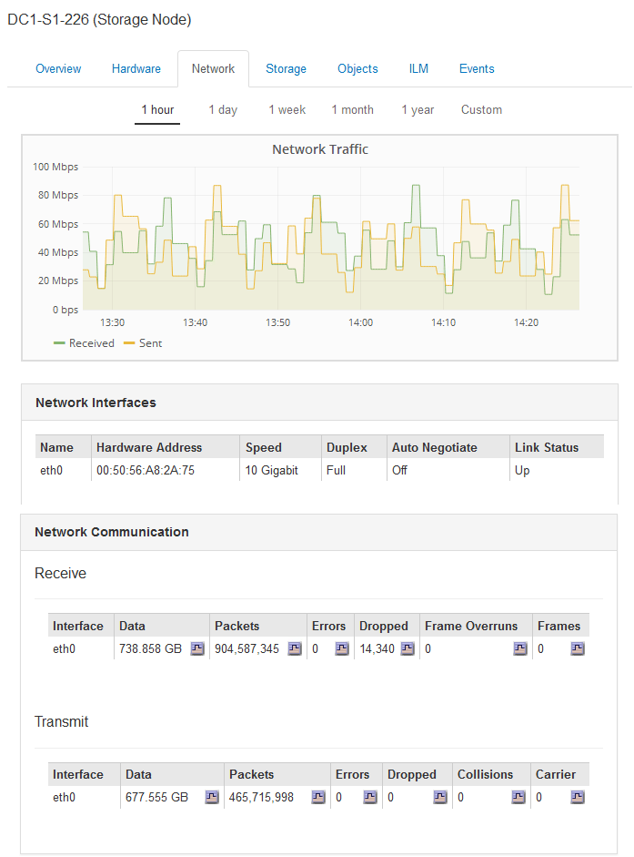

= Viewing the Network tab
:icons: font
:imagesdir: ../media/

[.lead]
The Network tab displays a graph showing the network traffic received and sent across all of the network interfaces on the node, site, or grid.

The Network tab is shown for all nodes, each site, and the entire grid.

To display a different time interval, select one of the controls above the chart or graph. You can display the information available for intervals of 1 hour, 1 day, 1 week, or 1 month. You can also set a custom interval, which allows you to specify date and time ranges.

For nodes, the Network Interfaces table provides information about each node's physical network ports. The Network Communications table provides details about each node's receive and transmit operations and any driver reported fault counters.

.Related information

xref:monitoring-network-connections-and-performance.adoc[Monitoring network connections and performance]
