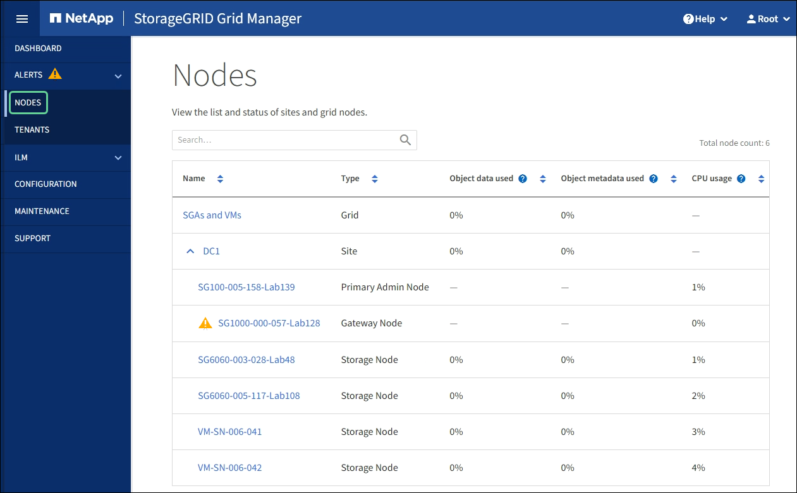

= View the Nodes page
:icons: font
:imagesdir: ../media/

[.lead]
When you need more detailed information about your StorageGRID system than the Dashboard provides, you can use the Nodes page to view metrics for the entire grid, each site in the grid, and each node at a site.

The Nodes table lists all the sites and nodes in your StorageGRID system. Summary information is displayed for each node. If a node has an active alert, an icon appears next to the node name. If the node is connected and has no active alerts, no icon is shown.

== Connection state icons

* *Not connected - Unknown* image:../media/icon_alarm_blue_unknown.png[blue question mark icon]: The node is not connected to the grid for an unknown reason. For example, the network connection between nodes has been lost or the power is down. The *Unable to communicate with node* alert might also be triggered. Other alerts might be active as well. This situation requires immediate attention.
+
NOTE: A node might appear as Unknown during managed shutdown operations. You can ignore the Unknown state in these cases.

* *Not connected - Administratively down* image:../media/icon_alarm_gray_administratively_down.png[gray questionmark icon]: The node is not connected to the grid for an expected reason. For example, the node, or services on the node, has been gracefully shut down, the node is rebooting, or the software is being upgraded. One or more alerts might also be active.

If a node is disconnected from the grid, it might have an underlying alert, but only the "`Not connected`" icon appears. To see the active alerts for a node, select the node.

== Alert icons

If there is an active alert for a node, one of the following icons appears next to the node name:

* *Critical* image:../media/icon_alert_red_critical.png[Icon Alert Red Critical]: An abnormal condition exists that has stopped the normal operations of a StorageGRID node or service. You must address the underlying issue immediately. Service disruption and loss of data might result if the issue is not resolved.

* *Major* image:../media/icon_alert_orange_major.png[Icon Alert Orange Major]: An abnormal condition exists that is either affecting current operations or approaching the threshold for a critical alert. You should investigate major alerts and address any underlying issues to ensure that the abnormal condition does not stop the normal operation of a StorageGRID node or service.

* *Minor* image:../media/icon_alert_yellow_minor.png[Icon Alert Yellow Minor]: The system is operating normally, but an abnormal condition exists that could affect the system's ability to operate if it continues. You should monitor and resolve minor alerts that do not clear on their own to ensure they do not result in a more serious problem.

== Viewing details for a system, site, or node

To view the available information, select the name of the grid, site, or node as follows:

* Select the grid name to see an aggregate summary of the statistics for your entire StorageGRID system.
* Select a specific data center site to see an aggregate summary of the statistics for all nodes at that site.
* Select a specific node to view detailed information for that node.

image::../media/nodes_page_grid_level.png[Nodes page grid level]
