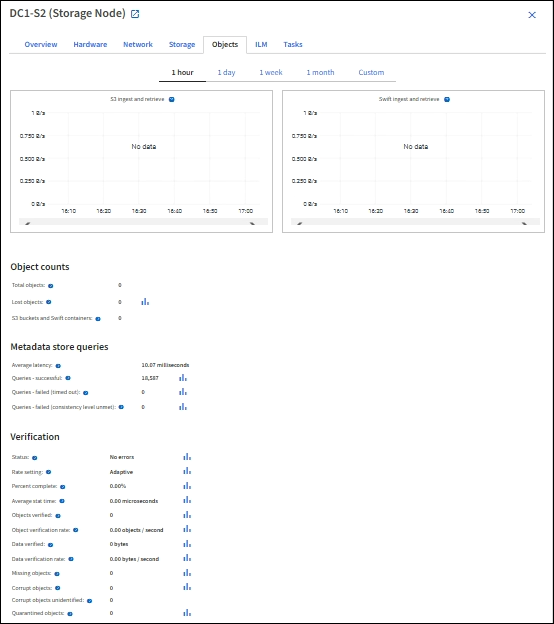

= Viewing the Objects tab
:icons: font
:imagesdir: ../media/

[.lead]
The Objects tab provides information about S3 and Swift ingest and retrieve rates.

The Objects tab is shown for each Storage Node, each site, and the entire grid. For Storage Nodes, the Objects tab also provides object counts and information about metadata queries and background verification.

.Related information

xref:../s3/index.adoc[Use S3]

xref:../swift/index.adoc[Use Swift]
