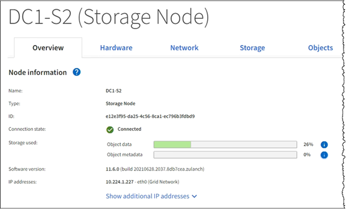
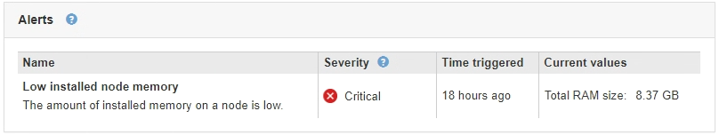

= View the Overview tab
:icons: font
:imagesdir: ../media/

[.lead]
The Overview tab provides basic information about each node. It also shows any alerts currently affecting the node.

The Overview tab is shown for all nodes.

== Node Information

The Node Information section of the Overview tab lists basic information about the grid node.

The overview information for a node includes the following:

* *Name*: The hostname assigned to the node and displayed in the Grid Manager.
* *Type*: The type of node -- Admin Node, primary Admin Node, Storage Node, Gateway Node, or Archive Node.
* *ID*: The unique identifier for the node, which is also referred to as the UUID.
* *Connection state*: One of three states. The icon for the most severe state is shown.
 ** *Unknown* image:../media/icon_alarm_blue_unknown.png[blue question mark icon]: The node is not connected to the grid for an unknown reason. For example, the network connection between nodes has been lost or the power is down. The *Unable to communicate with node* alert might also be triggered. Other alerts might be active as well. This situation requires immediate attention.
+
NOTE: A node might appear as Unknown during managed shutdown operations. You can ignore the Unknown state in these cases.

 ** *Administratively down* image:../media/icon_alarm_gray_administratively_down.png[gray questionmark icon]: The node is not connected to the grid for an expected reason. For example, the node, or services on the node, has been gracefully shut down, the node is rebooting, or the software is being upgraded. One or more alerts might also be active.
 ** *Connected* image:../media/icon_alert_green_checkmark.png[icon alert green checkmark]: The node is connected to the grid.
* *Storage used*: For Storage Nodes only.

** *Object data*: The percentage of the total usable space for object data that has been used on the Storage Node.
** *Object metadata*: The percentage of the total allowed space for object metadata that has been used on the Storage Node.

* *Software version*: The version of StorageGRID that is installed on the node.
* *HA groups*: For Admin Node and Gateway Nodes only. Shown if a network interface on the node is included in a high availability group and whether that interface is the Primary interface.
* *IP addresses*: The node's IP addresses. Click *Show additional IP addresses* to view the node's IPv4 and IPv6 addresses and interface mappings.

== Alerts

The Alerts section of the Overview tab lists any alerts currently affecting this node that have not been silenced. Click the alert name to view additional details and recommended actions.

.Related information

xref:monitoring-node-connection-states.adoc[Monitor node connection states]

xref:viewing-current-alerts.adoc[View current alerts]

xref:viewing-specific-alert.adoc[View a specific alert]
