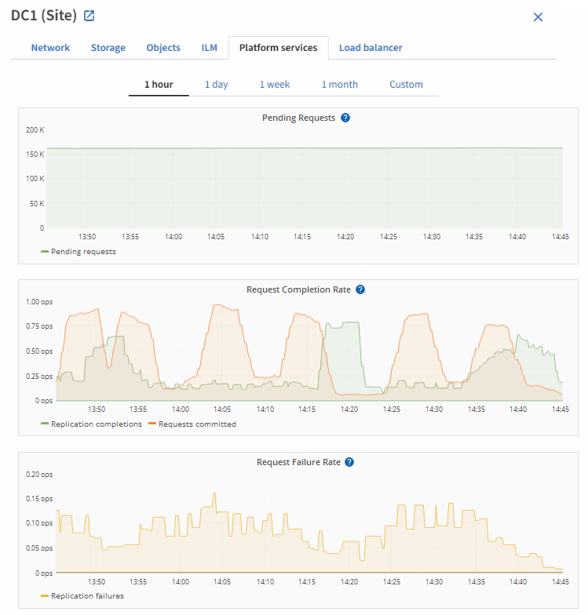

= Viewing the Platform Services tab
:icons: font
:imagesdir: ../media/

[.lead]
The Platform Services tab provides information about any S3 platform service operations at a site.

The Platform Services tab is shown for each site. This tab provides information about S3 platform services, such as CloudMirror replication and the search integration service. Graphs on this tab display metrics such as the number of pending requests, request completion rate, and request failure rate.

For more information about S3 platform services, including troubleshooting details, see the instructions for administering StorageGRID.

.Related information

xref:../admin/index.adoc[Administer StorageGRID]
