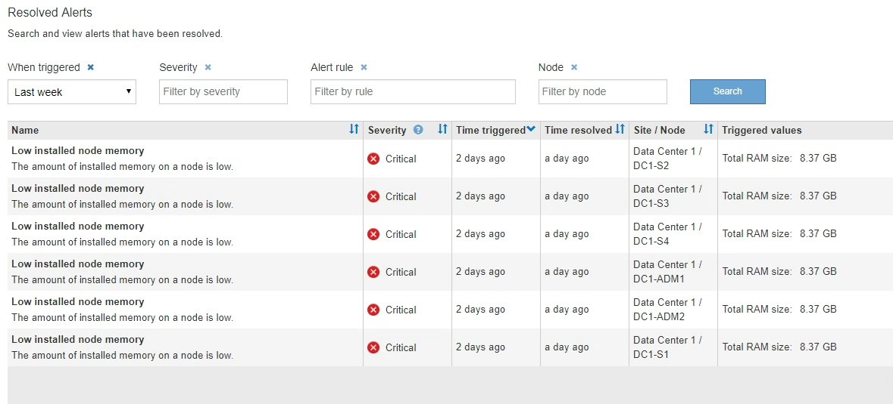

= View resolved alerts
:icons: font
:imagesdir: ../media/

[.lead]
You can search and view a history of alerts that have been resolved.

.What you'll need
* You must be signed in to the Grid Manager using a xref:../admin/web-browser-requirements.adoc[supported web browser].

.Steps
. To view resolved alerts, do either of the following:
 ** From the Health panel on the Dashboard, click *Recently resolved alerts*.
+
The *Recently resolved alerts* link appears only if one or more alerts were triggered in the past week and are now resolved.

 ** Select *ALERTS* > *Resolved*.
The Resolved Alerts page appears. By default, resolved alerts that were triggered in the last week are shown, with the most recently triggered alerts shown first. The alerts on this page were previously shown on the Current Alerts page or in an email notification.
+

. Review the information in the table.
+
[options="header"]
|===
| Column header| Description
a|
Name
a|
The name of the alert and its description.
a|
Severity
a|
The severity of the alert.

 ** *Critical* image:../media/icon_alert_red_critical.png[Icon Alert Red Critical]: An abnormal condition exists that has stopped the normal operations of a StorageGRID node or service. You must address the underlying issue immediately. Service disruption and loss of data might result if the issue is not resolved.
 ** *Major* image:../media/icon_alert_orange_major.png[Icon Alert Orange Major]: An abnormal condition exists that is either affecting current operations or approaching the threshold for a critical alert. You should investigate major alerts and address any underlying issues to ensure that the abnormal condition does not stop the normal operation of a StorageGRID node or service.
 ** *Minor* image:../media/icon_alert_yellow_minor.png[Icon Alert Yellow Minor]: The system is operating normally, but an abnormal condition exists that could affect the system's ability to operate if it continues. You should monitor and resolve minor alerts that do not clear on their own to ensure they do not result in a more serious problem.

a|
Time triggered
a|
How long ago the alert was triggered.
a|
Time resolved
a|
How long ago the alert was resolved.
a|
Site/Node
a|
The name of the site and node where the alert occurred.
a|
Triggered values
a|
The value of the metric that caused the alert to be triggered. For some alerts, additional values are shown to help you understand and investigate the alert. For example, the values shown for a *Low object data storage* alert include the percentage of disk space used, the total amount of disk space, and the amount of disk space used.
|===

. To sort the entire list of resolved alerts, click the up/down arrows image:../media/icon_alert_sort_column.png[Sort arrows icon] in each column header.
+
For example, you might want to sort resolved alerts by *Site/Node* to see the alerts that affected a specific node.

. Optionally, filter the list of resolved alerts by using the drop-down menus at the top of the table.
 .. Select a time period from the *When triggered* drop-down menu to show resolved alerts based on how long ago they were triggered.
+
You can search for alerts that were triggered within the following time periods:

  *** Last hour
  *** Last day
  *** Last week (default view)
  *** Last month
  *** Any time period
  *** Custom (allows you to specify the start date and the end date for the time period)

 .. Select one or more severities from the *Severity* drop-down menu to filter on resolved alerts of a specific severity.
 .. Select one or more default or custom alert rules from the *Alert rule* drop-down menu to filter on resolved alerts related to a specific alert rule.
 .. Select one or more nodes from the *Node* drop-down menu to filter on resolved alerts related to a specific node.
 .. Click *Search*.
. To view details for a specific resolved alert, select the alert from the table.
+
A dialog box for the alert appears. See xref:viewing-specific-alert.adoc[View a specific alert].
