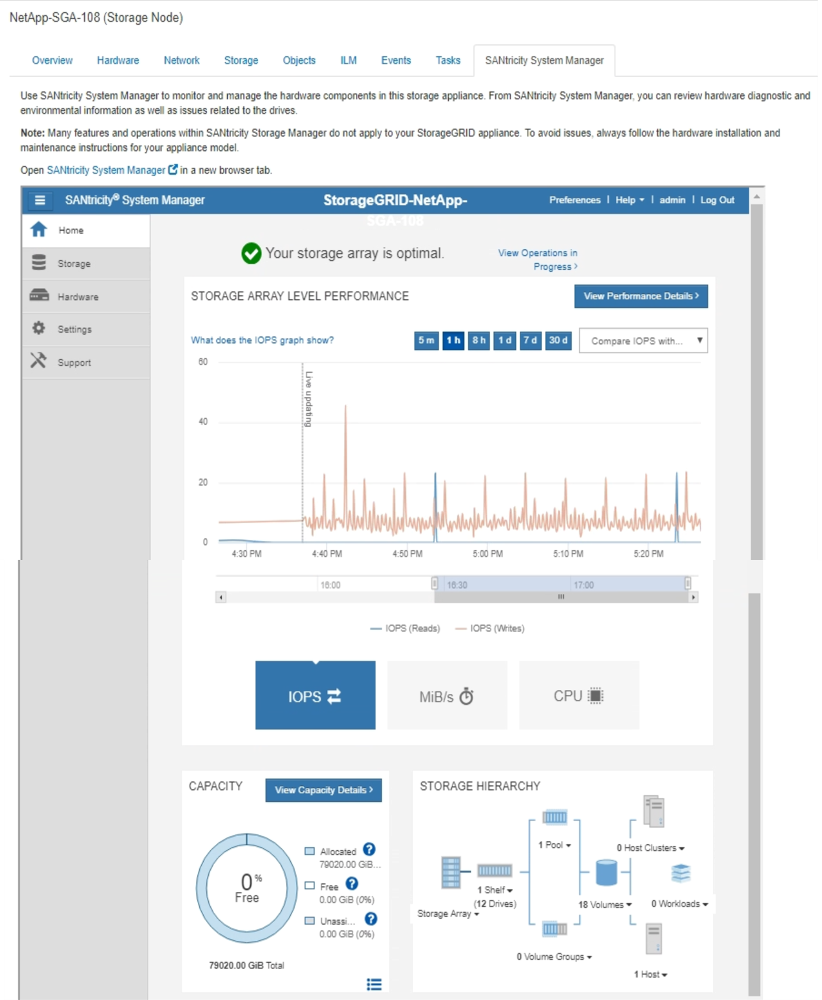

= Viewing the SANtricity System Manager tab
:icons: font
:imagesdir: ../media/

[.lead]
The SANtricity System Manager tab enables you to access SANtricity System Manager without having to configure or connect the management port of the storage appliance. You can use this tab to review hardware diagnostic and environmental information as well as issues related to the drives.

The SANtricity System Manager tab is shown for storage appliance nodes.

Using SANtricity System Manager, you can do the following:

* View performance data such as storage array level performance, I/O latency, storage controller CPU utilization, and throughput
* Check hardware component status
* Perform support functions including viewing diagnostic data, and configuring E-Series AutoSupport

NOTE: To use SANtricity System Manager to configure a proxy for E-Series AutoSupport, see the instructions in administeringStorageGRID.

xref:../admin/index.adoc[Administer StorageGRID]

To access SANtricity System Manager through Grid Manager, you must have the Storage Appliance Administrator permission or Root Access permission.

NOTE: You must have SANtricity firmware 8.70 or higher to access SANtricity System Manager using the Grid Manager.

IMPORTANT: Accessing SANtricity System Manager from the Grid Manager is generally meant only to monitor appliance hardware and configure E-Series AutoSupport. Many features and operations within SANtricity System Manager such as upgrading firmware do not apply to monitoring your StorageGRID appliance. To avoid issues, always follow the hardware installation and maintenance instructions for your appliance.

The tab displays the home page of SANtricity System Manager

NOTE: You can use the SANtricity System Manager link to open the SANtricity System Manager in a new browser window for easier viewing.

To see details for storage array level performance and capacity usage, hover your cursor over each graph.

For more details on viewing the information accessible from the SANtricity System Manager tab, see the information in the http://mysupport.netapp.com/info/web/ECMP1658252.html[NetApp E-Series Systems Documentation Center]
