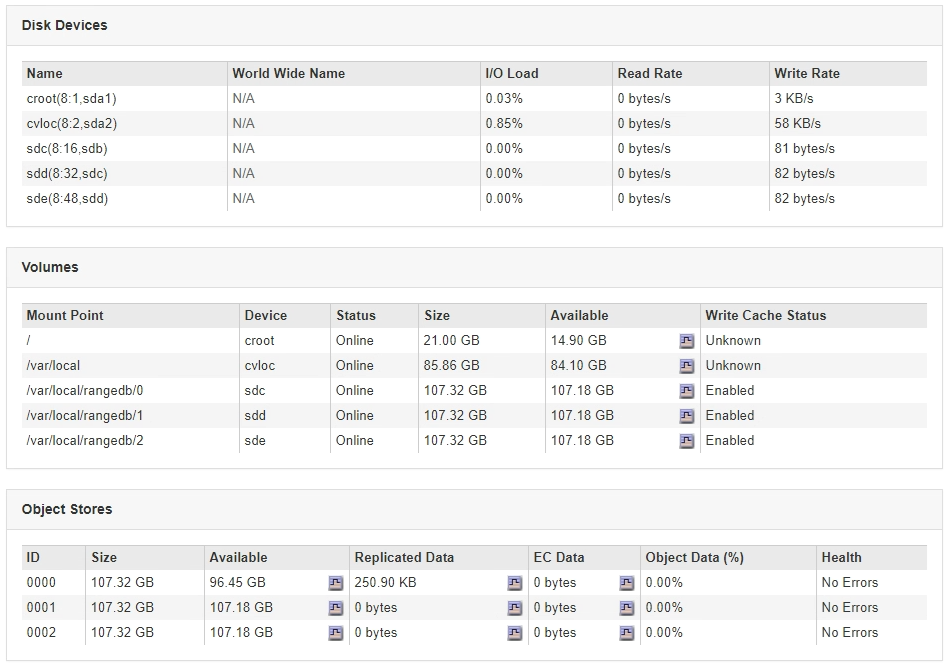

= Viewing the Storage tab
:icons: font
:imagesdir: ../media/

[.lead]
The Storage tab summarizes storage availability and other storage metrics.

The Storage tab is shown for all nodes, each site, and the entire grid.

== Storage Used graphs

For Storage Nodes, each site, and the entire grid, the Storage tab includes graphs showing how much storage has been used by object data and object metadata over time.

NOTE: The total values for a site or the grid do not include nodes that not have reported metrics for at least five minutes, such as offline nodes.

image::../media/nodes_storage_node_storage_tab.png[Nodes > Storage Node > Storage tab]

== Disk Devices, Volumes, and Object Store tables

For all nodes, the Storage tab contains details for the disk devices and volumes on the node. For Storage Nodes, the Object Stores table provides information about each storage volume.

.Related information

xref:monitoring-storage-capacity-for-entire-grid.adoc[Monitoring storage capacity for the entire grid]

xref:monitoring-storage-capacity-for-each-storage-node.adoc[Monitoring storage capacity for each Storage Node]

xref:monitoring-object-metadata-capacity-for-each-storage-node.adoc[Monitoring object metadata capacity for each Storage Node]
