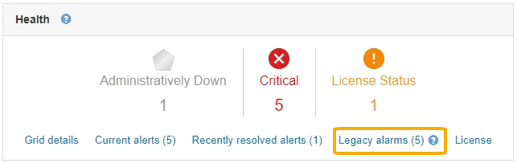
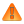

= Viewing legacy alarms
:icons: font
:imagesdir: ../media/

[.lead]
Alarms (legacy system) are triggered when system attributes reach alarm threshold values. You can view the currently active alarms from the Dashboard or the Current Alarms page.

.What you'll need
* You must be signed in to the Grid Manager using a xref:../admin/web_browser_requirements.adoc[supported web browser].

.About this task
If one or more of the legacy alarms are currently active, the Health panel on the Dashboard includes a *Legacy alarms* link. The number in parentheses indicates how many alarms are currently active.

The *Legacy alarms* count on the Dashboard is incremented whenever a legacy alarm is triggered. This count is incremented even if you have disabled alarm email notifications. You can typically ignore this number (since alerts provide a better view of the system), or you can view the alarms that are currently active.

NOTE: While the legacy alarm system continues to be supported, the alert system offers significant benefits and is easier to use.

.Steps
. To view the legacy alarms that are currently active, do one of the following:
 ** From the Health panel on the Dashboard, click *Legacy alarms*. This link appears only if at least one alarm is currently active.
 ** Select *Support* > *Alarms (legacy)* > *Current Alarms*.
The Current Alarms page appears.

image::../media/current_alarms_page.png[Current Alarms Page]

The alarm icon indicates the severity of each alarm, as follows:
[options="header"]
|===
| Icon| Color| Alarm severity| Meaning
a|
image:../media/icon_alarm_yellow_notice.gif[yellow square icon]
a|
Yellow
a|
Notice
a|
The node is connected to the grid, but an unusual condition exists that does not affect normal operations.
a|

a|
Light Orange
a|
Minor
a|
The node is connected to the grid, but an abnormal condition exists that could affect operation in the future. You should investigate to prevent escalation.
a|

a|
Dark Orange
a|
Major
a|
The node is connected to the grid, but an abnormal condition exists that currently affects operation. This requires prompt attention to prevent escalation.
a|

a|
Red
a|
Critical
a|
The node is connected to the grid, but an abnormal condition exists that has stopped normal operations. You should address the issue immediately.
|===
. To learn about the attribute that caused the alarm to be triggered, right click the attribute name in the table.
. To view additional details about an alarm, click the service name in the table.
+
The Alarms tab for the selected service appears (*Support* > *Tools* > *Grid Topology* > *_Grid Node_* > *_Service_* > *Alarms*).
+
image::../media/alarms_acknowledging.png[Alarms Acknowledging]

. If you want to clear the count of current alarms, you can optionally do the following:
 ** Acknowledge the alarm. An acknowledged alarm is no longer included in the count of legacy alarms unless it is triggered at the next severity level or it is resolved and occurs again.
 ** Disable a particular Default alarm or Global Custom alarm for the entire system to prevent it from being triggered again.

.Related information

xref:alarms_reference.adoc[Alarms reference (legacy system)]

xref:managing_alarms.adoc[Acknowledging current alarms (legacy system)]

xref:managing_alarms.adoc[Disabling alarms (legacy system)]
