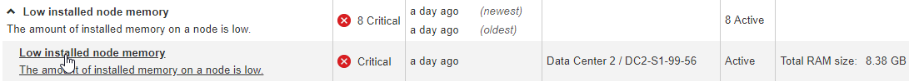
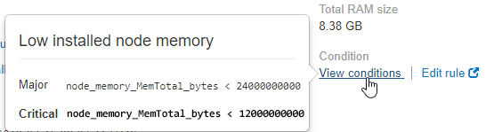

= Viewing a specific alert
:icons: font
:imagesdir: ../media/

[.lead]
You can view detailed information about an alert that is currently affecting your StorageGRID system or an alert that has been resolved. The details include recommended corrective actions, the time the alert was triggered, and the current value of the metrics related to this alert. Optionally, you can silence a current alert or update the alert rule.

* You must be signed in to the Grid Manager using a supported browser.

. Do one of the following, based on whether you want to view a current or resolved alert:
+
|===
    a|
*Current alert*
a|

 ** From the Health panel on the Dashboard, click the *Current alerts* link. This link appears only if at least one alert is currently active. This link is hidden if there are no current alerts or if all current alerts have been silenced.
 ** Select *Alerts* > *Current*.
 ** From the *Nodes* page, select the *Overview* tab for a node that has an alert icon. Then, in the Alerts section, click the alert name.

a|
*Resolved alert*
a|

 ** From the Health panel on the Dashboard, click the *Recently resolved alerts* link. (This link appears only if one or more alerts were triggered in the past week and are now resolved. This link is hidden if no alerts were triggered and resolved in the last week.)
 ** Select *Alerts* > *Resolved*.

+
|===

. As required, expand a group of alerts and then select the alert you want to view.
+
NOTE: Select the alert, not the heading for a group of alerts.
+

+
A dialog box appears and provides details for the selected alert.
+
image::../media/alerts_page_details_modal.png[Alerts Page Details Modal]

. Review the alert details.
+
|===
| Information| Description
a|
_title_
a|
The name of the alert.
a|
_first paragraph_
a|
The description of the alert.
a|
Recommended actions
a|
The recommended actions for this alert.
a|
Time triggered
a|
The date and time the alert was triggered in your local time and in UTC.
a|
Time resolved
a|
For resolved alerts only, the date and time the alert was resolved in your local time and in UTC.
a|
Status
a|
The status of the alert: Active, Silenced, or Resolved.
a|
Site/Node
a|
The name of the site and node affected by the alert.
a|
Severity
a|
The severity of the alert.

 ** *Critical* image:../media/icon_alert_red_critical.png[Icon Alert Red Critical]: An abnormal condition exists that has stopped the normal operations of a StorageGRID node or service. You must address the underlying issue immediately. Service disruption and loss of data might result if the issue is not resolved.
 ** *Major* image:../media/icon_alert_orange_major.png[Icon Alert Orange Major]: An abnormal condition exists that is either affecting current operations or approaching the threshold for a critical alert. You should investigate major alerts and address any underlying issues to ensure that the abnormal condition does not stop the normal operation of a StorageGRID node or service.
 ** *Minor* image:../media/icon_alert_yellow_miinor.png[Icon Alert Yellow Minor]: The system is operating normally, but an abnormal condition exists that could affect the system's ability to operate if it continues. You should monitor and resolve minor alerts that do not clear on their own to ensure they do not result in a more serious problem.

a|
_data values_
a|
The current value of the metric for this alert. For some alerts, additional values are shown to help you understand and investigate the alert. For example, the values shown for a *Low metadata storage* alert include the percent of disk space used, the total amount of disk space, and the amount of disk space used.
|===

. Optionally, click *silence this alert* to silence the alert rule that caused this alert to be triggered.
+
You must have the Manage Alerts or Root access permission to silence an alert rule.
+
IMPORTANT: Be careful when deciding to silence an alert rule. If an alert rule is silenced, you might not detect an underlying problem until it prevents a critical operation from completing.

. To view the current conditions for the alert rule:
 .. From the alert details, click *View conditions*.
+
A pop-up appears, listing the Prometheus expression for each defined severity.
+

 .. To close the pop-up, click anywhere outside of the pop-up.
. Optionally, click *Edit rule* to edit the alert rule that caused this alert to be triggered:
+
You must have the Manage Alerts or Root access permission to edit an alert rule.
+
IMPORTANT: Be careful when deciding to edit an alert rule. If you change trigger values, you might not detect an underlying problem until it prevents a critical operation from completing.

. To close the alert details, click *Close*.

.Related information

link:managing_alerts.md#[Silencing alert notifications]

link:managing_alerts.md#[Editing an alert rule]
