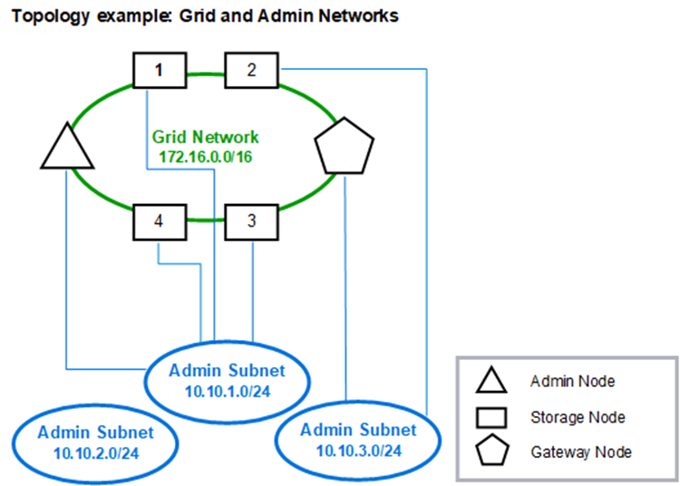
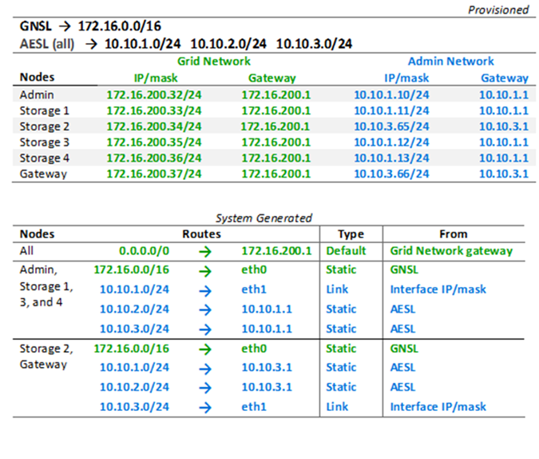

= Admin Network topology
:icons: font
:imagesdir: ../media/

[.lead]
Having an Admin Network is optional. One way that you can use an Admin Network and a Grid Network is to configure a routable Grid Network and a bounded Admin Network for each node.

When you configure the Admin Network, you establish the host IP address, subnet mask, and Gateway IP address for the eth1 interface for each grid node.

The Admin Network can be unique to each node and can consist of multiple subnets. Each node can be configured with an Admin External Subnet List (AESL). The AESL lists the subnets reachable over the Admin Network for each node. The AESL must also include the subnets of any services the grid will access over the Admin Network, such as NTP, DNS, KMS, and LDAP. Static routes are applied for each subnet in the AESL.

In this example, the Grid Network is used for traffic related to S3 and Swift client requests and object management. while the Admin Network is used for administrative functions.

