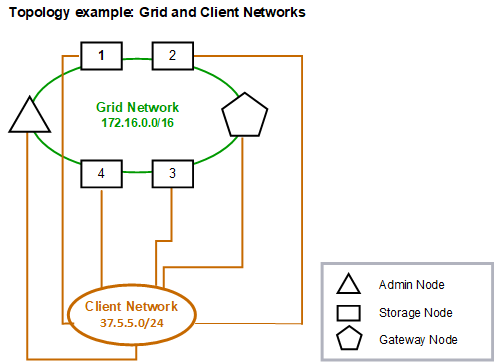
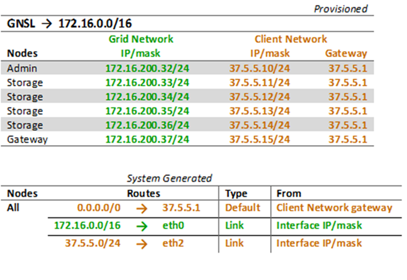

= Client Network topology
:icons: font
:imagesdir: ../media/

[.lead]
Having a Client Network is optional. Using a Client Network allows client network traffic (for example, S3 and Swift) to be separated from grid internal traffic, which allows grid networking to be more secure. Administrative traffic can be handled by either the Client or Grid Network when the Admin Network is not configured.

When you configure the Client Network, you establish the host IP address, subnet mask, and Gateway IP address for the eth2 interface for the configured node. Each node's Client Network can be independent of the Client Network on any other node.

If you configure a Client Network for a node during installation, the node's default gateway switches from the Grid Network gateway to the Client Network gateway when installation is complete. If a Client Network is added later, the node's default gateway switches in the same way.

In this example, the Client Network is used for S3 and Swift client requests and for administrative functions, while the Grid Network is dedicated to internal object management operations.

