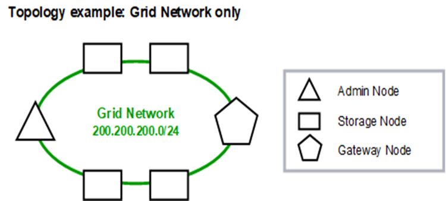
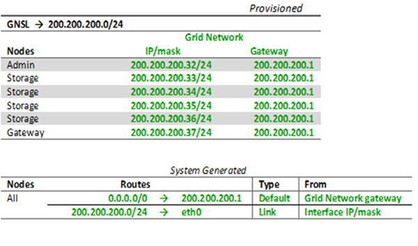

= Grid Network topology
:icons: font
:imagesdir: ../media/

[.lead]
The simplest network topology is created by configuring the Grid Network only.

When you configure the Grid Network, you establish the host IP address, subnet mask, and Gateway IP address for the eth0 interface for each grid node.

During configuration, you must add all Grid Network subnets to the Grid Network Subnet List (GNSL). This list includes all subnets for all sites, and might also include external subnets that provide access to critical services such as NTP, DNS, or LDAP.

At installation, the Grid Network interface applies static routes for all subnets in the GNSL and sets the node's default route to the Grid Network gateway if one is configured. The GNSL is not required if there is no Client Network and the Grid Network gateway is the node's default route. Host routes to all other nodes in the grid are also generated.

In this example, all traffic shares the same network, including traffic related to S3 and Swift client requests and administrative and maintenance functions.

NOTE: This topology is appropriate for single-site deployments that are not externally available, proof-of-concept or test deployments, or when a third-party load balancer acts as the client access boundary. When possible, the Grid Network should be used exclusively for internal traffic. Both the Admin Network and the Client Network have additional firewall restrictions that block external traffic to internal services. Using the Grid Network for external client traffic is supported, but this use offers fewer layers of protection.

