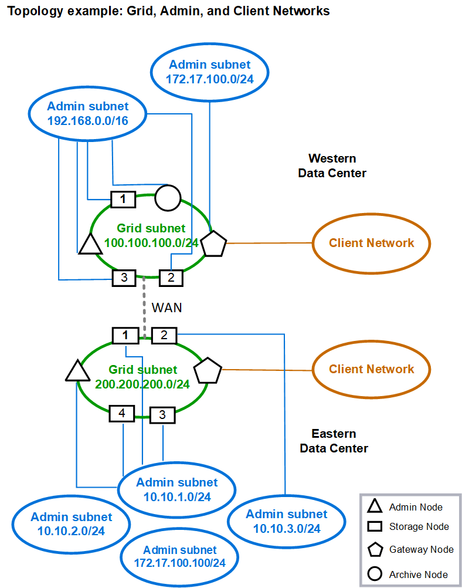

= Topology for all three networks
:icons: font
:imagesdir: ../media/

[.lead]
You can configure all three networks into a network topology consisting of a private Grid Network, bounded site-specific Admin Networks, and open Client Networks. Using load balancer endpoints and untrusted Client Networks can provide additional security if needed.

In this example:

* The Grid Network is used for network traffic related to internal object management operations.
* The Admin Network is used for traffic related to administrative functions.
* The Client Network is used for traffic related to S3 and Swift client requests.

