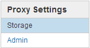

= Configure security settings
:icons: font
:imagesdir: ../media/

[.lead]
You can configure various security settings from the Grid Manager to help secure your StorageGRID system.

== Certificates

StorageGRID uses two types of security certificates:

* Server certificates are required when you use HTTPS connections. Server certificates are used to establish secure connections between clients and servers, authenticating the identity of a server to its clients and providing a secure communication path for data. The server and the client each have a copy of the certificate.

* Client certificates authenticate a client or user identity to the server, providing more secure authentication than passwords alone. Client certificates do not encrypt data.

You can view all StorageGRID certificates on the *CONFIGURATION* > *Security* > *Certificates* page.

== Key management servers

You can configure one or more external key management servers (KMS) to provide encryption keys to StorageGRID services and storage appliances. Each KMS or KMS cluster uses the Key Management Interoperability Protocol (KMIP) to provide an encryption key to the appliance nodes at the associated StorageGRID site. Using key management servers lets you protect StorageGRID data even if an appliance is removed from the data center. After the appliance volumes are encrypted, you cannot access any data on the appliance unless the node can communicate with the KMS.

NOTE: To use encryption key management, you must enable the *Node Encryption* setting for each appliance during installation, before the appliance is added to the grid.

== Proxy settings

If you are using S3 platform services or Cloud Storage Pools, you can configure a non-transparent proxy server between Storage Nodes and the external S3 endpoints. If you send AutoSupport messages using HTTPS or HTTP, you can configure a non-transparent proxy server between Admin Nodes and technical support.

== Untrusted Client Networks

If you are using a Client Network, you can help secure StorageGRID from hostile attacks by specifying that the Client Network on each node be untrusted. If a node's Client Network is untrusted, the node only accepts inbound connections on ports explicitly configured as load balancer endpoints.

For example, you might want a Gateway Node to refuse all inbound traffic on the Client Network except for HTTPS S3 requests. Or, you might want to enable outbound S3 platform service traffic from a Storage Node, while preventing any inbound connections to that Storage Node on the Client Network.

.Related information

* xref:../admin/index.adoc[Administer StorageGRID]

* xref:managing-tenants-and-client-connections.adoc[Manage tenants and client connections]
