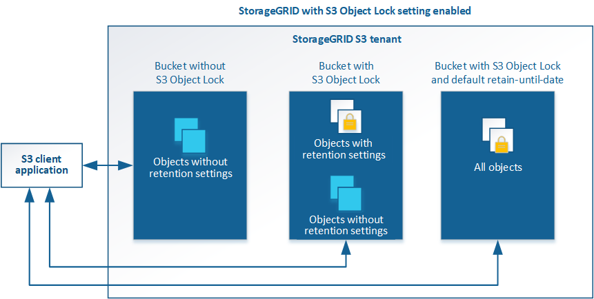

= Configure system settings
:icons: font
:imagesdir: ../media/

[.lead]
You can configure various system settings from the Grid Manager to fine tune the operation of your StorageGRID system.

== Display options

Display options allow you to specify the timeout period for user sessions and to suppress email notifications for legacy alarms and event-triggered AutoSupport messages.

== Grid options

You can use Grid Options to configure the settings for all of the objects stored in your StorageGRID system, including stored object compression, stored object encryption. and stored object hashing.

You can also use these options to specify global settings for S3 and Swift client operations.

== S3 Object Lock

The StorageGRID S3 Object Lock feature is an object-protection solution that is equivalent to S3 Object Lock in Amazon Simple Storage Service (Amazon S3). You can enable the global S3 Object Lock setting for a StorageGRID system to allow S3 tenant accounts to create buckets with S3 Object Lock enabled. The tenant can then use an S3 client application to optionally specify retention settings (retain until date, legal hold, or both) for the objects in those buckets. In addition, each bucket that has S3 Object Lock enabled can optionally have a default retention mode and retention period, which apply if objects are added to the bucket without their own retention settings.

== Storage options

Storage options allow you to control object segmentation and to override storage volume watermark settings to manage a Storage Node's usable storage space.
