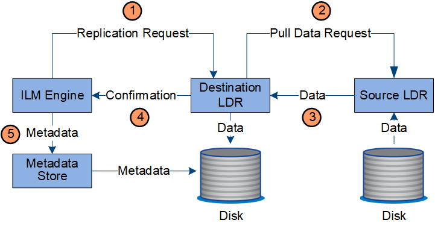
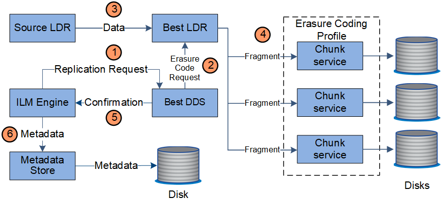
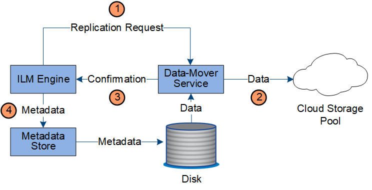

= Copy management
:icons: font
:imagesdir: ../media/

[.lead]
Object data is managed by the active ILM policy and its ILM rules. ILM rules make replicated or erasure coded copies to protect object data from loss.

Different types or locations of object copies might be required at different times in the object's life. ILM rules are periodically evaluated to ensure that objects are placed as required.

Object data is managed by the LDR service.

== Content protection: replication

If an ILM rule's content placement instructions require replicated copies of object data, copies are made and stored to disk by the Storage Nodes that make up the configured storage pool.

=== Data flow

The ILM engine in the LDR service controls replication and ensures that the correct number of copies are stored in the correct locations and for the correct amount of time.

. The ILM engine queries the ADC service to determine the best destination LDR service within the storage pool specified by the ILM rule. It then sends that LDR service a command to initiate replication.
. The destination LDR service queries the ADC service for the best source location. It then sends a replication request to the source LDR service.
. The source LDR service sends a copy to the destination LDR service.
. The destination LDR service notifies the ILM engine that the object data has been stored.
. The ILM engine updates the metadata store with object location metadata.

== Content protection: erasure coding

If an ILM rule includes instructions to make erasure coded copies of object data, the applicable erasure coding scheme breaks object data into data and parity fragments and distributes these fragments across the Storage Nodes configured in the Erasure Coding profile.

=== Data flow

The ILM engine, which is a component of the LDR service, controls erasure coding and ensures that the Erasure Coding profile is applied to object data.

. The ILM engine queries the ADC service to determine which DDS service can best perform the erasure coding operation. Once determined, the ILM engine sends an "initiate" request to that service.
. The DDS service instructs an LDR to erasure code the object data.
. The source LDR service sends a copy to the LDR service selected for erasure coding.
. Once broken into the appropriate number of parity and data fragments, the LDR service distributes these fragments across the Storage Nodes (Chunk services) that make up the Erasure Coding profile's storage pool.
. The LDR service notifies the ILM engine, confirming that object data is successfully distributed.
. The ILM engine updates the metadata store with object location metadata.

== Content protection: Cloud Storage Pool

If an ILM rule's content placement instructions require that a replicated copy of object data is stored on a Cloud Storage Pool, object data is moved to the external S3 bucket or Azure Blob storage container that was specified for the Cloud Storage Pool.

=== Data flow

The ILM engine, which is a component of the LDR service, and the Data Mover service control the movement of objects to the Cloud Storage Pool.

. The ILM engine selects a Data Mover service to replicate to the Cloud Storage Pool.
. The Data Mover service sends the object data to the Cloud Storage Pool.
. The Data Mover service notifies the ILM engine that the object data has been stored.
. The ILM engine updates the metadata store with object location metadata.

== Content protection: archive

An archive operation consists of a defined data flow between the StorageGRID system and the client.

If the ILM policy requires that a copy of object data be archived, the ILM engine, which is a component of the LDR service, sends a request to the Archive Node, which in turn sends a copy of the object data to the targeted archival storage system.

image::../media/archiving_data_flow.png[diagram showing the process described in surrounding text]

. The ILM engine sends a request to the ARC service to store a copy on archive media.
. The ARC service queries the ADC service for the best source location and sends a request to the source LDR service.
. The ARC service retrieves object data from the LDR service.
. The ARC service sends the object data to the archive media destination.
. The archive media notifies the ARC service that the object data has been stored.
. The ARC service notifies the ILM engine that the object data has been stored.
