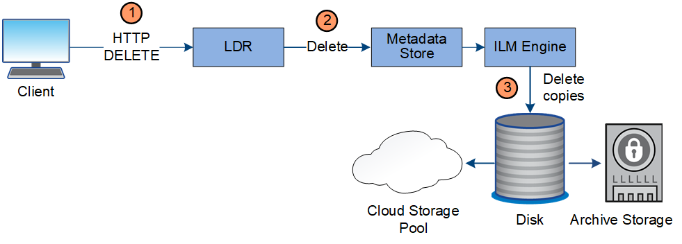
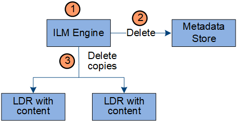

= Delete data flow
:icons: font
:imagesdir: ../media/

[.lead]
All object copies are removed from the StorageGRID system when a client performs a delete operation or when the object's lifetime expires, triggering its automatic removal. There is a defined data flow for object deletion.

== Deletion hierarchy

StorageGRID provides several methods for controlling when objects are retained or deleted. Objects can be delete by client request or automatically. StorageGRID always prioritizes any S3 Object Lock settings over client delete requests, which are prioritized over S3 bucket lifecycle and ILM placement instructions.

* *S3 Object Lock*: If the global S3 Object Lock setting is enabled for the grid, S3 clients can create buckets with S3 Object Lock enabled and then use the S3 REST API to specify retain-until-date and legal hold settings for each object version added to that bucket.
 ** An object version that is under a legal hold cannot be deleted by any method.
 ** Before an object version's retain-until-date is reached, that version cannot be deleted by any method.
 ** Objects in buckets with S3 Object Lock enabled are retained by ILM "`forever`". However, after its retain-until-date is reached, an object version can be deleted by a client request or the expiration of the bucket lifecycle.
* *Client delete request*: An S3 or Swift client can issue a delete object request. When a client deletes an object, all copies of the object are removed from the StorageGRID system.
* *S3 bucket lifecycle*: S3 clients can add a lifecycle configuration to their buckets that specifies an Expiration action. If a bucket lifecycle exists, StorageGRID automatically deletes all copies of an object when the date or number of days specified in the Expiration action are met, unless the client deletes the object first.
* *ILM placement instructions*: Assuming that the bucket does not have S3 Object Lock enabled and that there is no bucket lifecycle, StorageGRID automatically deletes an object when the last time period in the ILM rule ends and there are no further placements specified for the object.
+
NOTE: The Expiration action in an S3 bucket lifecycle always overrides ILM settings. As a result, an object might be retained on the grid even after any ILM instructions for placing the object have lapsed.

== Data flow for client deletes

. The LDR service receives a delete request from the client application.
. The LDR service updates the metadata store so the object looks deleted to client requests, and instructs the ILM engine to remove all copies of object data.
. The object is removed from the system. The metadata store is updated to remove object metadata.

== Data flow for ILM deletes

. The ILM engine determines that the object needs to be deleted.
. The ILM engine notifies the metadata store. The metadata store updates object metadata so that the object looks deleted to client requests.
. The ILM engine removes all copies of the object. The metadata store is updated to remove object metadata.
