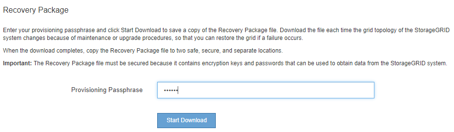

= Download the Recovery Package
:icons: font
:imagesdir: ../media/

[.lead]
The Recovery Package is a downloadable .zip file that contains deployment-specific files and software needed to install, expand, upgrade, and maintain a StorageGRID system.

The Recovery Package file also contains system-specific configuration and integration information, including server hostnames and IP addresses, and highly confidential passwords needed during system maintenance, upgrade, and expansion. The Recovery Package is required to recover from the failure of the primary Admin Node.

When installing a StorageGRID system, you are required to download the Recovery Package file and to confirm that you can successfully access the contents of this file. You should also download the file each time the grid topology of the StorageGRID system changes because of maintenance or upgrade procedures.

After downloading the Recovery Package file and confirming you can extract the contents, copy the Recovery Package file to two safe, secure, and separate locations.

IMPORTANT: The Recovery Package file must be secured because it contains encryption keys and passwords that can be used to obtain data from the StorageGRID system.

.Related information

* xref:../upgrade/index.adoc[Upgrade software]

* xref:../expand/index.adoc[Expand your grid]

* xref:../maintain/index.adoc[Recover and maintain]
