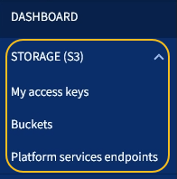
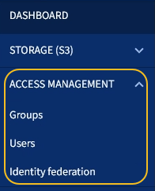

= Explore the Tenant Manager
:icons: font
:imagesdir: ../media/

[.lead]
The Tenant Manager is the browser-based graphical interface that tenant users access to configure, manage, and monitor their storage accounts.

When tenant users sign in to the Tenant Manager, they are connecting to an Admin Node.

== Tenant Manager Dashboard

After a grid administrator creates a tenant account using the Grid Manager or the Grid Management API, tenant users can sign in to the Tenant Manager.

The Tenant Manager Dashboard allows tenant users to monitor storage usage at a glance. The Storage usage panel contains a list of the largest buckets (S3) or containers (Swift) for the tenant. The Space used value is the total amount of object data in the bucket or container. The bar chart represents the relative sizes of these buckets or containers.

The value shown above the bar chart is a sum of the space used for all of the tenant's buckets or containers. If the maximum number of gigabytes, terabytes, or petabytes available for the tenant was specified when the account was created, the amount of quota used and remaining are also shown.

image::../media/tenant_dashboard_with_buckets.png[Tenant Manager Dashboard]

== Storage menu (S3 tenants only)

The Storage menu is provided for S3 tenant accounts only. This menu allows S3 users to manage access keys, create and delete buckets, and manage platform service endpoints.

=== My access keys

S3 tenant users can manage access keys as follows:

* Users who have the Manage Your Own S3 Credentials permission can create or remove their own S3 access keys.
* Users who have the Root Access permission can manage the access keys for the S3 root account, their own account, and all other users. Root access keys also provide full access to the tenant's buckets and objects unless explicitly disabled by a bucket policy.
+

NOTE: Managing the access keys for other users takes place from the Access Management menu.

=== Buckets

S3 tenant users with the appropriate permissions can perform the following tasks related to buckets:

* Create buckets
* Enable S3 Object Lock for a new bucket (assumes that S3 Object Lock is enabled for the StorageGRID system)
* Update consistency level settings
* Apply a default retention setting
* Configure cross-origin resource sharing (CORS)
* Enable and disable last access time update settings for the buckets belonging to the tenant
* Delete empty buckets
* Manage the objects in a bucket using the xref:../tenant/use-s3-console.adoc[experimental S3 Console]

If a grid administrator has enabled the use of platform services for the tenant account, an S3 tenant user with the appropriate permissions can also perform these tasks:

* Configure S3 event notifications, which can be sent to a destination service that supports the AWS Simple Notification Service™ (SNS).
* Configure CloudMirror replication, which enables the tenant to automatically replicate objects to an external S3 bucket.
* Configure search integration, which sends object metadata to a destination search index whenever an object is created, deleted, or its metadata or tags are updated.

=== Platform services endpoints

If a grid administrator has enabled the use of platform services for the tenant account, an S3 tenant user with the Manage Endpoints permission can configure a destination endpoint for each platform service.

== Access Management menu

The Access Management menu allows StorageGRID tenants to import user groups from a federated identity source and assign management permissions. Tenants can also manage local tenant groups and users, unless single sign-on (SSO) is in effect for the entire StorageGRID system.

.Related information

* xref:exploring-grid-manager.adoc[Explore the Grid Manager]

* xref:../tenant/index.adoc[Use a tenant account]
