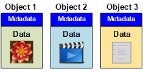

= How StorageGRID manages data
:icons: font
:imagesdir: ../media/

[.lead]
As you begin working with the StorageGRID system, it is helpful to understand how the StorageGRID system manages data.

== What an object is

With object storage, the unit of storage is an object, rather than a file or a block. Unlike the tree-like hierarchy of a file system or block storage, object storage organizes data in a flat, unstructured layout. Object storage decouples the physical location of the data from the method used to store and retrieve that data.

Each object in an object-based storage system has two parts: object data and object metadata.

=== Object data

Object data might be anything; for example, a photograph, a movie, or a medical record.

=== Object metadata

Object metadata is any information that describes an object. StorageGRID uses object metadata to track the locations of all objects across the grid and to manage each object's lifecycle over time.

Object metadata includes information such as the following:

* System metadata, including a unique ID for each object (UUID), the object name, the name of the S3 bucket or Swift container, the tenant account name or ID, the logical size of the object, the date and time the object was first created, and the date and time the object was last modified.
* The current storage location of each object copy or erasure-coded fragment.
* Any user metadata associated with the object.

Object metadata is customizable and expandable, making it flexible for applications to use.

For detailed information about how and where StorageGRID stores object metadata, go to xref:../admin/managing-object-metadata-storage.adoc[Manage object metadata storage].

== How object data is protected

The StorageGRID system provides you with two mechanisms to protect object data from loss: replication and erasure coding.

=== Replication

When StorageGRID matches objects to an information lifecycle management (ILM) rule that is configured to create replicated copies, the system creates exact copies of object data and stores them on Storage Nodes, Archive Nodes, or Cloud Storage Pools. ILM rules dictate the number of copies made, where those copies are stored, and for how long they are retained by the system. If a copy is lost, for example, as a result of the loss of a Storage Node, the object is still available if a copy of it exists elsewhere in the StorageGRID system.

In the following example, the Make 2 Copies rule specifies that two replicated copies of each object be placed in a storage pool that contains three Storage Nodes.

image::../media/ilm_replication_make_2_copies.png[Make 2 Copies rule]

=== Erasure coding

When StorageGRID matches objects to an ILM rule that is configured to create erasure-coded copies, it slices object data into data fragments, computes additional parity fragments, and stores each fragment on a different Storage Node. When an object is accessed, it is reassembled using the stored fragments. If a data or a parity fragment becomes corrupt or lost, the erasure coding algorithm can recreate that fragment using a subset of the remaining data and parity fragments. ILM rules and erasure coding profiles determine the erasure coding scheme used.

The following example illustrates the use of erasure coding on an object's data. In this example, the ILM rule uses a 4+2 erasure coding scheme. Each object is sliced into four equal data fragments, and two parity fragments are computed from the object data. Each of the six fragments is stored on a different Storage Node across three data centers to provide data protection for node failures or site loss.

image::../media/ec_three_sites_4_plus_2.png[Erasure Coded Three Sites 4 Plus 2]

.Related information

* xref:../ilm/index.adoc[Manage objects with ILM]

* xref:using-information-lifecycle-management.adoc[Use information lifecycle management]
