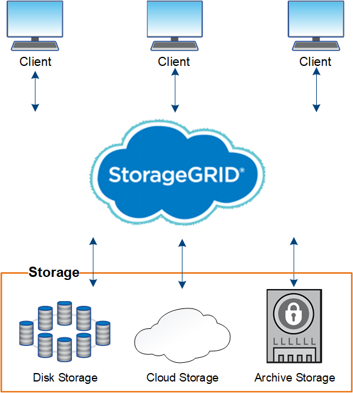

= Grid primer: Overview
:icons: font
:imagesdir: ../media/

[.lead]
Use these introduction to get an overview of the StorageGRID system and to learn about StorageGRID architecture and networking topology, data management features, and user interface. 

== What is StorageGRID?
NetApp StorageGRID is a software-defined, object-based storage solution that supports industry-standard object APIs, including the Amazon Simple Storage Service (S3) API and the OpenStack Swift API.

StorageGRID provides secure, durable storage for unstructured data at scale. Integrated, metadata-driven lifecycle management policies optimize where your data lives throughout its life. Content is placed in the right location, at the right time, and on the right storage tier to reduce cost.

StorageGRID is composed of geographically distributed, redundant, heterogeneous nodes, which can be integrated with both existing and next-generation client applications.

Advantages of the StorageGRID system include the following:

* Massively scalable and easy-to-use a geographically distributed data repository for unstructured data.
* Standard object storage protocols:
 ** Amazon Web Services Simple Storage Service (S3)
 ** OpenStack Swift
* Hybrid cloud enabled. Policy-based information lifecycle management (ILM) stores objects to public clouds, including Amazon Web Services (AWS) and Microsoft Azure. StorageGRID platform services enable content replication, event notification, and metadata searching of objects stored to public clouds.
* Flexible data protection to ensure durability and availability. Data can be protected using replication and layered erasure coding. At-rest and in-flight data verification ensures integrity for long-term retention.
* Dynamic data lifecycle management to help manage storage costs. You can create ILM rules that manage data lifecycle at the object level, and customize data locality, durability, performance, cost, and retention time. Tape is available as an integrated archive tier.
* High availability of data storage and some management functions, with integrated load balancing to optimize the data load across StorageGRID resources.
* Support for multiple storage tenant accounts to segregate the objects stored on your system by different entities.
* Numerous tools for monitoring the health of your StorageGRID system, including a comprehensive alert system, a graphical dashboard, and detailed statuses for all nodes and sites.
* Support for software or hardware-based deployment. You can deploy StorageGRID on any of the following:
 ** Virtual machines running in VMware.
 ** Container engines on Linux hosts.
 ** StorageGRID engineered appliances. 
 *** Storage appliances provide object storage. 
 *** Services appliances provide grid administration and load balancing services.
* Compliant with the relevant storage requirements of these regulations:
 ** Securities and Exchange Commission (SEC) in 17 CFR § 240.17a-4(f), which regulates exchange members, brokers or dealers.
 ** Financial Industry Regulatory Authority (FINRA) Rule 4511(c), which defers to the format and media requirements of SEC Rule 17a-4(f).
 ** Commodity Futures Trading Commission (CFTC) in regulation 17 CFR § 1.31(c)-(d), which regulates commodity futures trading.
* Non-disruptive upgrade and maintenance operations. Maintain access to content during upgrade, expansion, decommission, and maintenance procedures.
* Federated identity management. Integrates with Active Directory, OpenLDAP, or Oracle Directory Service for user authentication. Supports single sign-on (SSO) using the Security Assertion Markup Language 2.0 (SAML 2.0) standard to exchange authentication and authorization data between StorageGRID and Active Directory Federation Services (AD FS).
