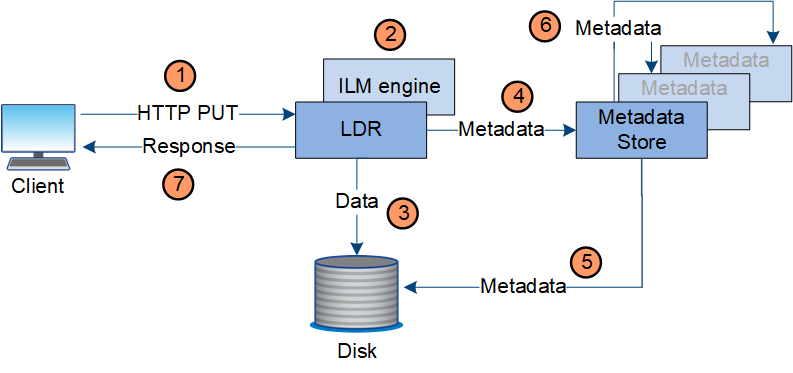

= Ingest data flow
:icons: font
:imagesdir: ../media/

[.lead]
An ingest, or save, operation consists of a defined data flow between the client and the StorageGRID system.

== Data flow

When a client saves an object to the StorageGRID system, the LDR service on Storage Nodes processes the request and stores the metadata and data to disk.

. The client application creates the object and sends it to the StorageGRID system through an HTTP PUT request.
. The object is evaluated against the system's ILM policy.
. The LDR service saves the object data as a replicated copy or as an erasure coded copy. (The diagram shows a simplified version of storing a replicated copy to disk.)
. The LDR service sends the object metadata to the metadata store.
. The metadata store saves the object metadata to disk.
. The metadata store propagates copies of object metadata to other Storage Nodes. These copies are also saved to disk.
. The LDR service returns an HTTP 200 OK response to the client to acknowledge that the object has been ingested.
