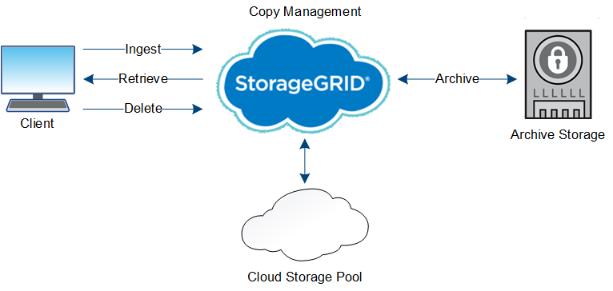

= The life of an object
:icons: font
:imagesdir: ../media/

[.lead]
An object's life consists of various stages. Each stage represents the operations that occur with the object.

The life of an object includes the operations of ingest, copy management, retrieve, and delete.

* *Ingest*: The process of an S3 or Swift client application saving an object over HTTP to the StorageGRID system. At this stage, the StorageGRID system begins to manage the object.
* *Copy management*: The process of managing replicated and erasure-coded copies in StorageGRID, as described by the ILM rules in the active ILM policy. During the copy management stage, StorageGRID protects object data from loss by creating and maintaining the specified number and type of object copies on Storage Nodes, in a Cloud Storage Pool, or on Archive Node.
* *Retrieve*: The process of a client application accessing an object stored by the StorageGRID system. The client reads the object, which is retrieved from a Storage Node, Cloud Storage Pool, or Archive Node.
* *Delete*: The process of removing all object copies from the grid. Objects can be deleted either as a result of the client application sending a delete request to the StorageGRID system, or as a result of an automatic process that StorageGRID performs when the object's lifetime expires.

.Related information

* xref:../ilm/index.adoc[Manage objects with ILM]

* xref:using-information-lifecycle-management.adoc[Use information lifecycle management]
