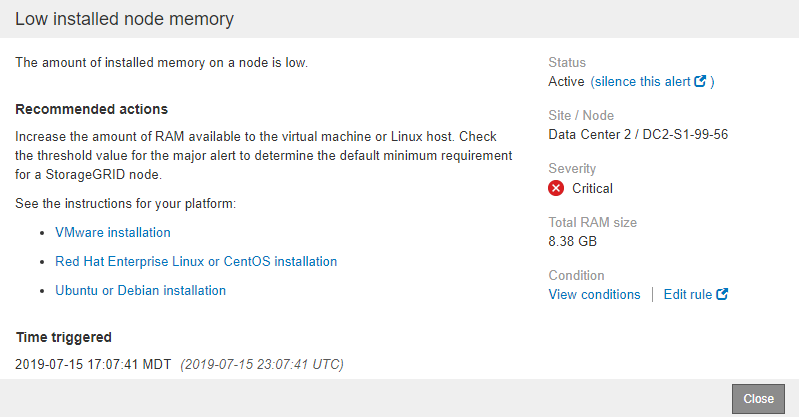

= Monitor and manage alerts
:icons: font
:imagesdir: ../media/

[.lead]
The alert system provides an easy-to-use interface for detecting, evaluating, and resolving the issues that can occur during StorageGRID operation.

The alert system is designed to be your primary tool for monitoring any issues that might occur in your StorageGRID system.

* The alert system focuses on actionable problems in the system. Alerts are triggered for events that require your immediate attention, not for events that can safely be ignored.
* The Current Alerts and Resolved Alerts pages provide a user friendly interface for viewing current and historical problems. You can sort the listing by individual alerts and alert groups. For example, you might want to sort all alerts by node/site to see which alerts are affecting a specific node. Or, you might want to sort the alerts in a group by time triggered to find the most recent instance of a specific alert.
* Multiple alerts of the same type are grouped into one email to reduce the number of notifications. In addition, multiple alerts of the same type are shown as a group on the Current Alerts and Resolved Alerts pages. You can expand and collapse alert groups to show or hide the individual alerts. For example, if several nodes are reporting the *Unable to communicate with node* alert, only one email is sent and the alert is shown as a group on the Current Alerts page.
+
image::../media/alerts_current_page.png[Alerts Page]

* Alerts use intuitive names and descriptions to help you understand more quickly what the problem is. Alert notifications include details about the node and site affected, the alert severity, the time when the alert rule was triggered, and the current value of metrics related to the alert.
* Alert email notifications and the alert listings on the Current Alerts and Resolved Alerts pages provide recommended actions for resolving an alert. These recommended actions often include direct links to  StorageGRID documentation to make it easier to find and access more detailed troubleshooting procedures.
+

NOTE:  The legacy alarm system is deprecated. The user interface and APIs for the legacy alarm system will be removed in a future release. The alert system offers significant benefits and is easier to use.

== Manage alerts

All StorageGRID users can view alerts. If you have the Root Access or Manage Alerts permission, you can also manage alerts, as follows:

* If you need to temporarily suppress the notifications for an alert at one or more severity levels, you can easily silence a specific alert rule for a specified duration. You can silence an alert rule for the entire grid, a single site, or a single node.
* You can edit the default alert rules as required. You can disable an alert rule completely, or change its trigger conditions and duration.
* You can create custom alert rules to target the specific conditions that are relevant to your situation and to provide your own recommended actions. To define the conditions for a custom alert, you create expressions using the Prometheus metrics available from the Metrics section of the Grid Management API.
+
For example, this expression causes an alert to be triggered if the amount of installed RAM for a node is less than 24,000,000,000 bytes (24 GB).
+
----
node_memory_MemTotal < 24000000000
----

.Related information

xref:../monitor/index.adoc[Monitor and troubleshoot]
