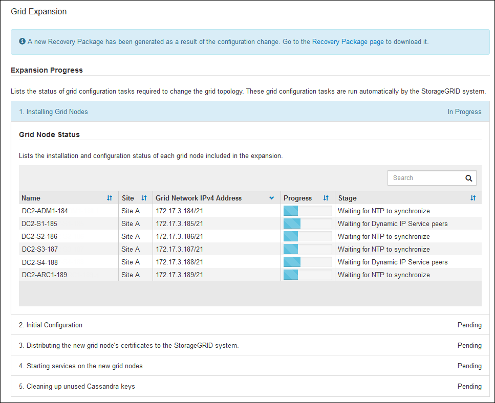

= Perform maintenance
:icons: font
:imagesdir: ../media/

[.lead]
You perform various maintenance procedures to keep your StorageGRID system up-to-date and to ensure it is performing efficiently. The Grid Manager provides tools and options to facilitate the process of performing maintenance tasks.

== Software updates

You can perform three types of software updates from the Software Update page in the Grid Manager:

* StorageGRID software upgrade
* StorageGRID hotfix
* SANtricity OS upgrade

== StorageGRID software upgrades

When a new StorageGRID feature release is available, the Software Upgrade page guides you through the process of uploading the required file and upgrading your StorageGRID system. You must upgrade all grid nodes for all data center sites from the primary Admin Node.

During a StorageGRID software upgrade, client applications can continue to ingest and retrieve object data.

== Hotfixes

If issues with the software are detected and resolved between feature releases, you might need to apply a hotfix to your StorageGRID system.

StorageGRID hotfixes contain software changes that are made available outside of a feature or patch release. The same changes are included in a future release.

The StorageGRID Hotfix page, shown below, allows you to upload a hotfix file.

image::../media/hotfix_choose_file.png[StorageGRID first Hotfix page]

The hotfix is applied first to the primary Admin Node. Then, you must approve the application of the hotfix to other grid nodes until all nodes in your StorageGRID system are running the same software version. You can customize the approval sequence by selecting to approve individual grid nodes, groups of grid nodes, or all grid nodes.

NOTE: While all grid nodes are updated with the new hotfix version, the actual changes in a hotfix might only affect specific services on specific types of nodes. For example, a hotfix might only affect the LDR service on Storage Nodes.

== SANtricity OS upgrades

You might need to upgrade the SANtricity OS Software on the storage controllers of your storage appliances, if the controllers are not functioning optimally. You can upload the SANtricity OS file to the primary Admin Node in your StorageGRID system and apply the upgrade from the Grid Manager.

The SANtricity page, shown below, allows you to upload the SANtricity OS upgrade file.

image::../media/santricity_os_upgrade_first.png[StorageGRID first SANtricity OS page]

After you upload the file, you can approve the upgrade on individual Storage Nodes or all nodes. The ability to selectively approve nodes makes it easier for you to schedule the upgrade. After you approve a node for upgrade, the system performs a health check and installs the upgrade if it is applicable to the node.

== Expansion procedures

You can expand a StorageGRID system by adding storage volumes to Storage Nodes, adding new grid nodes to an existing site, or adding a new data center site. If you have Storage Nodes that use the SG6060 storage appliance, you can add one or two expansion shelves to double or triple the storage capacity of the node.

You can perform expansions without interrupting the operation of your current system. When you add nodes or a site, you first deploy the new nodes and then perform the expansion procedure from the Grid Expansion page.

== Node recovery procedures

Grid nodes can fail if a hardware, virtualization, operating system, or software fault renders the node inoperable or unreliable.

The steps to recover a grid node depend on the platform where the grid node is hosted and on the type of grid node. Each type of grid node has a specific recovery procedure, which you must follow exactly. Generally, you try to preserve data from the failed grid node where possible, repair or replace the failed node, use the Recovery page to configure the replacement node, and restore the node's data.

For example, this flowchart shows the recovery procedure if an Admin Node has failed.

image::../media/overview_admin_node_recovery.png[Overview: Admin Node Recovery]

== Decommission procedures

You might want to permanently remove grid nodes or an entire data center site from your StorageGRID system.

For example, you might want to decommission one or more grid nodes in these cases:

* You have added a larger Storage Node to the system and you want to remove one or more smaller Storage Nodes, while at the same time preserving objects.
* You require less total storage.
* You no longer require a Gateway Node or a non-primary Admin Node.
* Your grid includes a disconnected node that you cannot recover or bring back online.

You can use the Decommission Nodes page in the Grid Manager to remove the following types of grid nodes:

* Storage Nodes, unless not enough nodes would remain at the site to support certain requirements
* Gateway Nodes
* Non-primary Admin Nodes

image::../media/decommission_nodes_page_all_connected.png[screenshot of Decommission page]

You can use the Decommission Site page in the Grid Manager to remove a site. A connected site decommission removes an operational site and preserves data. A disconnected site decommission removes a failed site but does not preserve data. The Decommission Site wizard guides you through the process of selecting the site, viewing site details, revising the ILM policy, removing site references from ILM rules, and resolving any node conflicts.

image::../media/decommission_site_step_select_site.png[Decommission Site Step 1]

== Network maintenance procedures

Some of the network maintenance procedures you might need to perform include the following:

* Updating the subnets on the Grid Network
* Using the Change IP tool to change the networking configuration that was initially set during grid deployment
* Adding, removing, or updating domain name system (DNS) servers
* Adding, removing, or updating network time protocol (NTP) servers to ensure that data is synchronized accurately between grid nodes
* Restoring network connectivity to nodes that might have become isolated from the rest of the grid

== Host-level and middleware procedures

Some maintenance procedures are specific to StorageGRID nodes that are deployed on Linux or VMware, or are specific to other components of the StorageGRID solution. For example, you might want to migrate a grid node to a different Linux host or perform maintenance on an Archive Node that is connected to Tivoli Storage Manager (TSM).

== Appliance node cloning

Appliance node cloning lets you easily replace an existing appliance node in your grid with an appliance of newer design or increased capabilities that is part of the same logical StorageGRID site. The process transfers all data to the new appliance, placing it in service to replace the old appliance node and leaving the old appliance in a pre-install state. Cloning provides a hardware-upgrade process that is easy to perform, and provides an alternate method for replacing appliances.

== Grid node procedures

You might need to perform certain procedures on a specific grid node. For example, you might need to reboot a grid node or manually stop and restart a specific grid node service. Some grid node procedures can be performed from the Grid Manager; others require you to log in to the grid node and use the node's command line.

.Related information

* xref:../admin/index.adoc[Administer StorageGRID]

* xref:../upgrade/index.adoc[Upgrade software]

* xref:../expand/index.adoc[Expand your grid]

* xref:../maintain/index.adoc[Recover and maintain]
