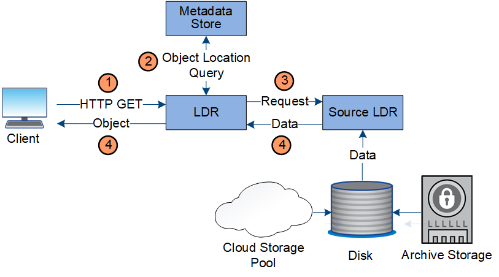

= Retrieve data flow
:icons: font
:imagesdir: ../media/

[.lead]
A retrieve operation consists of a defined data flow between the StorageGRID system and the client. The system uses attributes to track the retrieval of the object from a Storage Node or, if necessary, a Cloud Storage Pool or Archive Node.

The Storage Node's LDR service queries the metadata store for the location of the object data and retrieves it from the source LDR service. Preferentially, retrieval is from a Storage Node. If the object is not available on a Storage Node, the retrieval request is directed to a Cloud Storage Pool or to an Archive Node.

NOTE: If the only object copy is on AWS Glacier storage or the Azure Archive tier, the client application must issue an S3 POST Object restore request to restore a retrievable copy to the Cloud Storage Pool.

. The LDR service receives a retrieval request from the client application.
. The LDR service queries the metadata store for the object data location and metadata.
. LDR service forwards the retrieval request to the source LDR service.
. The source LDR service returns the object data from the queried LDR service and the system returns the object to the client application.
