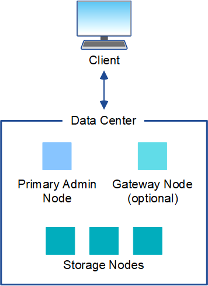
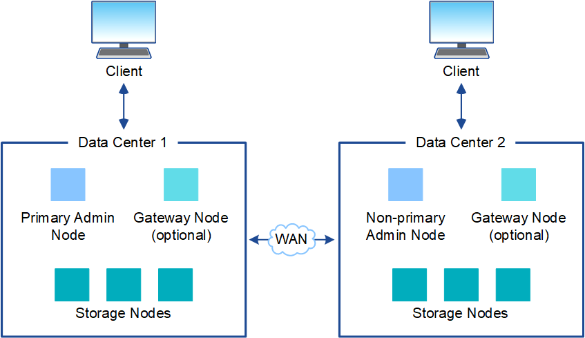
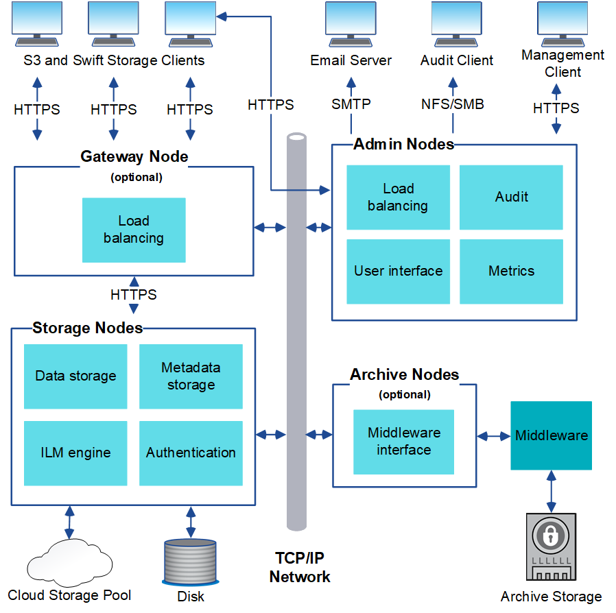

= StorageGRID architecture and network topology
:icons: font
:imagesdir: ../media/

[.lead]
A StorageGRID system consists of multiple types of grid nodes at one or more data center sites.

For additional information about StorageGRID network topology, requirements, and grid communications, see the xref:../network/index.adoc[Networking guidelines]. 

== Deployment topologies

The StorageGRID system can be deployed to a single data center site or to multiple data center sites.

=== Single site

In a deployment with a single site, the infrastructure and operations of the StorageGRID system are centralized.

=== Multiple sites

In a deployment with multiple sites, different types and numbers of StorageGRID resources can be installed at each site. For example, more storage might be required at one data center than at another.

Different sites are often located in geographically different locations across different failure domains, such as an earthquake fault line or flood plain. Data sharing and disaster recovery are achieved by automated distribution of data to other sites.

Multiple logical sites can also exist within a single data center to allow the use of distributed replication and erasure coding for increase availability and resiliency.

=== Grid node redundancy

In a single-site or multi-site deployment, you can optionally include more than one Admin Node or Gateway Node for redundancy. For example, you can install more than one Admin Node at a single site or across several sites. However, each StorageGRID system can only have one primary Admin Node.

== System architecture

This diagram shows how grid nodes are arranged within a StorageGRID system.

S3 and Swift clients store and retrieve objects in StorageGRID. Other clients are used to send email notifications, to access the StorageGRID management interface, and optionally to access the audit share.

S3 and Swift clients can connect to a Gateway Node or an Admin Node to use the load-balancing interface to Storage Nodes. Alternatively, S3 and Swift clients can connect directly to Storage Nodes using HTTPS.

Objects can be stored within StorageGRID on software or hardware-based Storage Nodes, on external archival media such as tape, or in Cloud Storage Pools, which consist of external S3 buckets or Azure Blob storage containers.

== Grid nodes and services

The basic building block of a StorageGRID system is the grid node. Nodes contain services, which are software modules that provide a set of capabilities to a grid node.

The StorageGRID system uses four types of grid nodes:

* *Admin Nodes* provide management services such as system configuration, monitoring, and logging. When you sign in to the Grid Manager, you are connecting to an Admin Node. Each grid must have one primary Admin Node and might have additional non-primary Admin Nodes for redundancy. You can connect to any Admin Node, and each Admin Node displays a similar view of the StorageGRID system. However, maintenance procedures must be performed using the primary Admin Node.
+
Admin Nodes can also be used to load balance S3 and Swift client traffic.

* *Storage Nodes* manage and store object data and metadata. Each StorageGRID system must have at least three Storage Nodes. If you have multiple sites, each site within your StorageGRID system must also have three Storage Nodes.
* *Gateway Nodes (optional)* provide a load-balancing interface that client applications can use to connect to StorageGRID. A load balancer seamlessly directs clients to an optimal Storage Node, so that the failure of nodes or even an entire site is transparent. You can use a combination of Gateway Nodes and Admin Nodes for load balancing, or you can implement a third-party HTTP load balancer.
* *Archive Nodes (optional)* provide an interface through which object data can be archived to tape.

To learn more, see xref:../admin/index.adoc[Administer StorageGRID].

=== Software-based nodes

Software-based grid nodes can be deployed in the following ways:

* As virtual machines (VMs) in VMware vSphere
* Within container engines on Linux hosts. The following operating systems are supported:
 ** Red Hat Enterprise Linux
 ** CentOS
 ** Ubuntu
 ** Debian

See the following for more information:

* xref:../vmware/index.adoc[Install VMware]

* xref:../rhel/index.adoc[Install Red Hat Enterprise Linux or CentOS]

* xref:../ubuntu/index.adoc[Install Ubuntu or Debian]

Use the https://mysupport.netapp.com/matrix[NetApp Interoperability Matrix Tool^] to get a list of supported versions.

=== StorageGRID appliance nodes

StorageGRID hardware appliances are specially designed for use in a StorageGRID system. Some appliances can be used as Storage Nodes. Other appliances can be used as Admin Nodes or Gateway Nodes. You can combine appliance nodes with software-based nodes or deploy fully engineered, all-appliance grids that have no dependencies on external hypervisors, storage, or compute hardware.

Four types of StorageGRID appliances are available:

* The *SG100 and SG1000 services appliances* are 1-rack-unit (1U) servers that can each operate as the primary Admin Node, a non-primary Admin Node, or a Gateway Node. Both appliances can operate as Gateway Nodes and Admin Nodes (primary and non-primary) at the same time.
* The *SG6000 storage appliance* operates as a Storage Node and combines the 1U SG6000-CN compute controller with a 2U or 4U storage controller shelf. The SG6000 is available in two models:
 ** *SGF6024*: Combines the SG6000-CN compute controller with a 2U storage controller shelf that includes 24 solid state drives (SSDs) and redundant storage controllers.
 ** *SG6060*: Combines the SG6000-CN compute controller with a 4U enclosure that includes 58 NL-SAS drives, 2 SSDs, and redundant storage controllers. Each SG6060 appliance supports one or two 60-drive expansion shelves, providing up to 178 drives dedicated to object storage.
* The *SG5700 storage appliance* is an integrated storage and computing platform that operates as a Storage Node. The SG5700 is available in two models:
 ** *SG5712*: a 2U enclosure that includes 12 NL-SAS drives and integrated storage and compute controllers.
 ** *SG5760*: a 4U enclosure that includes 60 NL-SAS drives and integrated storage and compute controllers.
* The *SG5600 storage appliance* is an integrated storage and computing platform that operates as a Storage Node. The SG5600 is available in two models:
 ** *SG5612*: a 2U enclosure that includes 12 NL-SAS drives and integrated storage and compute controllers.
 ** *SG5660*: a 4U enclosure that includes 60 NL-SAS drives and integrated storage and compute controllers.

See the following for more information:

* https://hwu.netapp.com[NetApp Hardware Universe^] 

* xref:../sg100-1000/index.adoc[SG100 and SG1000 services appliances]

* xref:../sg6000/index.adoc[SG6000 storage appliances]

* xref:../sg5700/index.adoc[SG5700 storage appliances]

* xref:../sg5600/index.adoc[SG5600 storage appliances]

=== Primary services for Admin Nodes

The following table shows the primary services for Admin Nodes; however, this table does not list all node services.

[cols="1a,2a" options="header"]
|===
| Service| Key function
a|
Audit Management System (AMS)
a|
Tracks system activity.
a|
Configuration Management Node (CMN)
a|
Manages system-wide configuration. Primary Admin Node only.
a|
Management Application Program Interface (mgmt-api)
a|
Processes requests from the Grid Management API and the Tenant Management API.
a|
High Availability
a|
Manages high availability virtual IP addresses for groups of Admin Nodes and Gateway Nodes.

*Note:* This service is also found on Gateway Nodes.

a|
Load Balancer
a|
Provides load balancing of S3 and Swift traffic from clients to Storage Nodes.

*Note:* This service is also found on Gateway Nodes.

a|
Network Management System (NMS)
a|
Provides functionality for the Grid Manager.
a|
Prometheus
a|
Collects and stores metrics.
a|
Server Status Monitor (SSM)
a|
Monitors the operating system and underlying hardware.
|===

=== Primary services for Storage Nodes

The following table shows the primary services for Storage Nodes; however, this table does not list all node services.

NOTE: Some services, such as the ADC service and the RSM service, typically exist only on three Storage Nodes at each site.

[cols="1a,2a" options="header"]
|===
| Service| Key function
a|
Account (acct)
a|
Manages tenant accounts.
a|
Administrative Domain Controller (ADC)
a|
Maintains topology and grid-wide configuration.
a|
Cassandra
a|
Stores and protects object metadata.
a|
Cassandra Reaper
a|
Performs automatic repairs of object metadata.
a|
Chunk
a|
Manages erasure-coded data and parity fragments.
a|
Data Mover (dmv)
a|
Moves data to Cloud Storage Pools.
a|
Distributed Data Store (DDS)
a|
Monitors object metadata storage.
a|
Identity (idnt)
a|
Federates user identities from LDAP and Active Directory.
a|
Local Distribution Router (LDR)
a|
Processes object storage protocol requests and manages object data on disk.
a|
Replicated State Machine (RSM)
a|
Ensures that S3 platform service requests are sent to their respective endpoints.
a|
Server Status Monitor (SSM)
a|
Monitors the operating system and underlying hardware.
|===

=== Primary services for Gateway Nodes

The following table shows the primary services for Gateway Nodes; however, this table does not list all node services.

[cols="1a,2a" options="header"]
|===
| Service| Key function
a|
Connection Load Balancer (CLB)
a|
Provides Layers 3 and 4 load balancing of S3 and Swift traffic from clients to Storage Nodes. Legacy load balancing mechanism.

*Note:* The CLB service is deprecated.

a|
High Availability
a|
Manages high availability virtual IP addresses for groups of Admin Nodes and Gateway Nodes.

*Note:* This service is also found on Admin Nodes.

a|
Load Balancer
a|
Provides Layer 7 load balancing of S3 and Swift traffic from clients to Storage Nodes. This is the recommended load balancing mechanism.

*Note:* This service is also found on Admin Nodes.

a|
Server Status Monitor (SSM)
a|
Monitors the operating system and underlying hardware.
|===

=== Primary services for Archive Nodes

The following table shows the primary services for Archive Nodes; however, this table does not list all node services.

[cols="1a,2a" options="header"]
|===
| Service| Key function
a|
Archive (ARC)
a|
Communicates with a Tivoli Storage Manager (TSM) external tape storage system.
a|
Server Status Monitor (SSM)
a|
Monitors the operating system and underlying hardware.
|===

=== StorageGRID services

The following is a complete list of StorageGRID services.

* *Account Service Forwarder*
+
Provides an interface for the Load Balancer service to query the Account Service on remote hosts and provides notifications of Load Balancer Endpoint configuration changes to the Load Balancer service. The Load Balancer service is present on Admin Nodes and Gateway Nodes.

* *ADC service (Administrative Domain Controller)*
+
Maintains topology information, provides authentication services, and responds to queries from the LDR and CMN services. The ADC service is present on each of the first three Storage Nodes installed at a site.

* *AMS service (Audit Management System)*
+
Monitors and logs all audited system events and transactions to a text log file. The AMS service is present on Admin Nodes.

* *ARC service (Archive)*
+
Provides the management interface with which you configure connections to external archival storage, such as the cloud through an S3 interface or tape through TSM middleware. The ARC service is present on Archive Nodes.

* *Cassandra Reaper service*
+
Performs automatic repairs of object metadata. The Cassandra Reaper service is present on all Storage Nodes.

* *Chunk service*
+
Manages erasure-coded data and parity fragments. The Chunk service is present on Storage Nodes.

* *CLB service (Connection Load Balancer)*
+
Deprecated service that provides a gateway into StorageGRID for client applications connecting through HTTP. The CLB service is present on Gateway Nodes. The CLB service is deprecated and will be removed in a future StorageGRID release.

* *CMN service (Configuration Management Node)*
+
Manages system-wide configurations and grid tasks. Each grid has one CMN service, which is present on the primary Admin Node.

* *DDS service (Distributed Data Store)*
+
Interfaces with the Cassandra database to manage object metadata. The DDS service is present on Storage Nodes.

* *DMV service (Data Mover)*
+
Moves data to cloud endpoints. The DMV service is present on Storage Nodes.

* *Dynamic IP service*
+
Monitors the grid for dynamic IP changes and updates local configurations. The Dynamic IP (dynip) service is present on all nodes.

* *Grafana service*
+
Used for metrics visualization in the Grid Manager. The Grafana service is present on Admin Nodes.

* *High Availability service*
+
Manages high availability Virtual IPs on nodes configured on the High Availability Groups page. The High Availability service is present on Admin Nodes and Gateway Nodes. This service is also known as the keepalived service.

* *Identity (idnt) service*
+
Federates user identities from LDAP and Active Directory. The Identity service (idnt) is present on three Storage Nodes at each site.

* *Lambda Arbitrator service*
+
Manages S3 Select SelectObjectContent requests.

* *Load Balancer service*
+
Provides load balancing of S3 and Swift traffic from clients to Storage Nodes. The Load Balancer service can be configured through the Load Balancer Endpoints configuration page. The Load Balancer service is present on Admin Nodes and Gateway Nodes. This service is also known as the nginx-gw service.

* *LDR service (Local Distribution Router)*
+
Manages the storage and transfer of content within the grid. The LDR service is present on Storage Nodes.

* *MISCd Information Service Control Daemon service*
+
Provides an interface for querying and managing services on other nodes and for managing environmental configurations on the node such as querying the state of services running on other nodes. The MISCd service is present on all nodes.

* *nginx service*
+
Acts as an authentication and secure communication mechanism for various grid services (such as Prometheus and Dynamic IP) to be able to talk to services on other nodes over HTTPS APIs. The nginx service is present on all nodes.

* *nginx-gw service*
+
Powers the Load Balancer service. The nginx-gw service is present on Admin Nodes and Gateway Nodes.

* *NMS service (Network Management System)*
+
Powers the monitoring, reporting, and configuration options that are displayed through the Grid Manager. The NMS service is present on Admin Nodes.

* *Persistence service*
+
Manages files on the root disk that need to persist across a reboot. The Persistence service is present on all nodes.

* *Prometheus service*
+
Collects time series metrics from services on all nodes. The Prometheus service is present on Admin Nodes.

* *RSM service (Replicated State Machine Service)*
+
Ensures platform service requests are sent to their respective endpoints. The RSM service is present on Storage Nodes that use the ADC service.

* *SSM service (Server Status Monitor)*
+
Monitors hardware conditions and reports to the NMS service. An instance of the SSM service is present on every grid node.

* *Trace collector service*
+
Performs trace collection to gather information for use by technical support. The trace collector service uses open source Jaeger software and is present on Admin Nodes.

