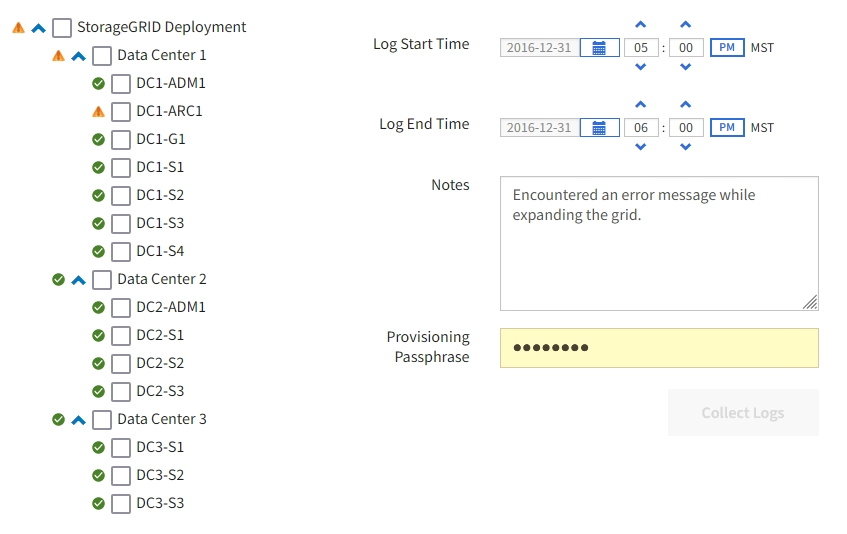
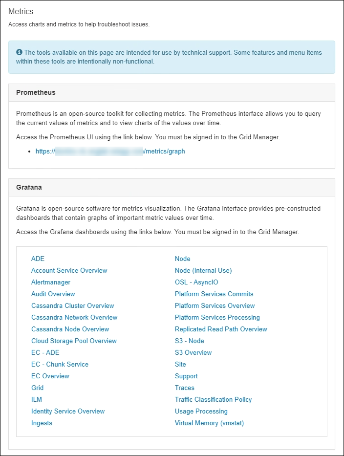
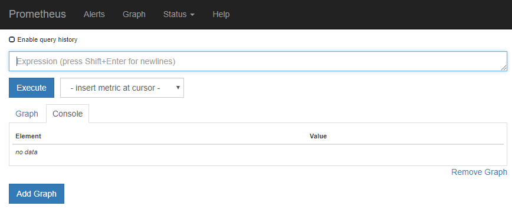
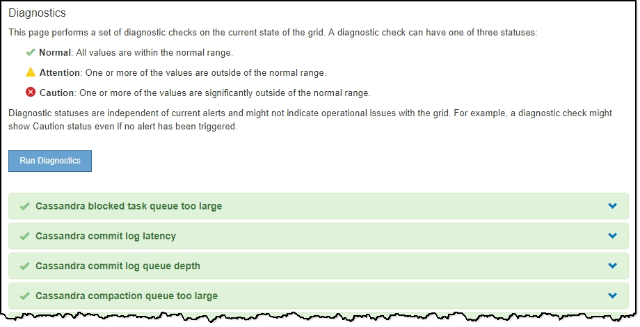
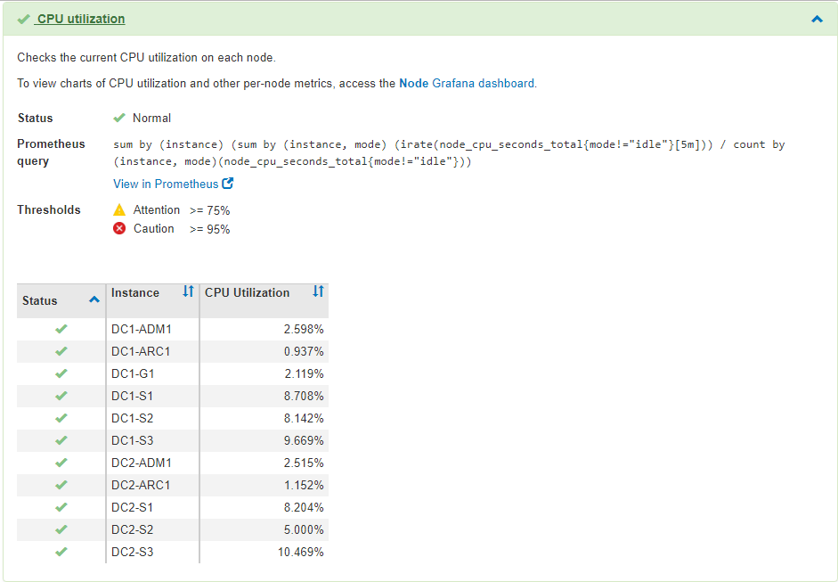

= Use StorageGRID support options
:icons: font
:imagesdir: ../media/

[.lead]
The Grid Manager provides options to help you work with technical support if an issue arises with your StorageGRID system.

== Configure AutoSupport

The AutoSupport feature enables your StorageGRID system to send health and status messages to technical support. Using AutoSupport can significantly speed problem determination and resolution. Technical support can also monitor the storage needs of your system and help you determine if you need to add new nodes or sites. Optionally, you can configure AutoSupport messages to be sent to one additional destination.

You configure AutoSupport using the Grid Manager (*SUPPORT* > *Tools* > *AutoSupport*). The *AutoSupport* page has two tabs: *Settings* and *Results*.

image::../media/autosupport_accessing_settings.png[AutoSupport page in Grid Manager]

=== Information included in AutoSupport messages

include::../_include/autosupport-message-info.adoc[]

=== Use Active IQ

include::../_include/autosupport-activeiq.adoc[]

== Collect StorageGRID logs

To help troubleshoot a problem, you might need to collect log files and forward them to technical support.

StorageGRID uses log files to capture events, diagnostic messages, and error conditions. The bycast.log file is maintained for every grid node and is the primary troubleshooting file. StorageGRID also creates log files for individual StorageGRID services, log files related to deployment and maintenance activities, and log files related to third-party applications.

Users who have the appropriate permissions and who know the provisioning passphrase for your StorageGRID system can use the Logs page in the Grid Manager to gather log files, system data, and configuration data. When you collect logs, you select a node or nodes and specify a time period. Data is collected and archived in a `.tar.gz` file, which you can download to a local computer. Inside this file, there is one log file archive for each grid node.

== Use metrics and run diagnostics

When troubleshooting an issue, you can work with technical support to review detailed metrics and charts for your StorageGRID system. You can also run pre-constructed diagnostic queries to proactively assess key values for your StorageGRID system.

=== Metrics page

The Metrics page provides access to the Prometheus and Grafana user interfaces. Prometheus is open-source software for collecting metrics. Grafana is open-source software for metrics visualization.

IMPORTANT: The tools available on the Metrics page are intended for use by technical support. Some features and menu items within these tools are intentionally non-functional and are subject to change.

The link in the Prometheus section of the Metrics page allows you to query the current values of StorageGRID metrics and to view graphs of the values over time.

NOTE: Metrics that include _private_ in their names are intended for internal use only and are subject to change between StorageGRID releases without notice.

The links in the Grafana section of the Metrics page allow you to access pre-constructed dashboards containing graphs of StorageGRID metrics over time.

image::../media/metrics_page_grafana.png[Metrics Page Grafana]

=== Diagnostics page

The Diagnostics page performs a set of pre-constructed diagnostic checks on the current state of the grid. In the example, all diagnostics have a Normal status.

Clicking a specific diagnostic lets you see details about the diagnostic and its current results.

In this example, the current CPU utilization for every node in a StorageGRID system is shown. All node values are below the Attention and Caution thresholds, so the overall status of the diagnostic is Normal.

.Related information

* xref:../admin/index.adoc[Administer StorageGRID]

* xref:configuring-network-settings.adoc[Configure network settings]
