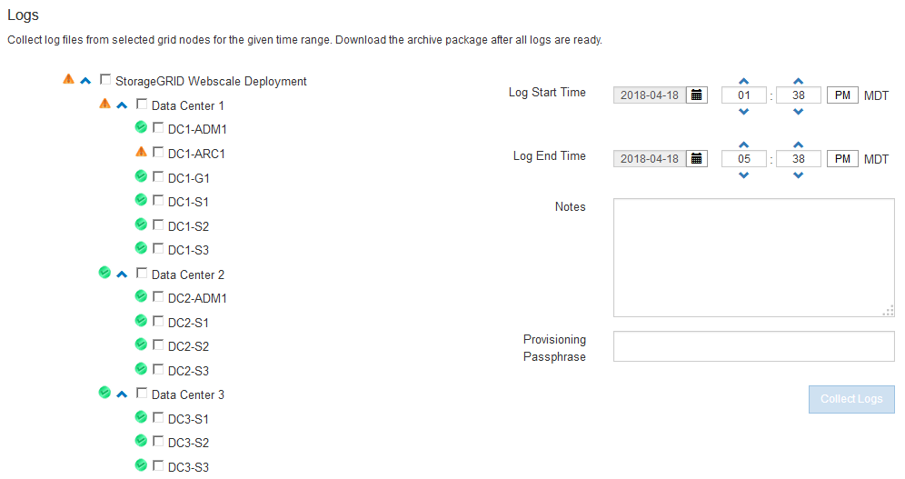

= Using StorageGRID support options
:icons: font
:imagesdir: ../media/

[.lead]
The Grid Manager provides options to help you work with technical support if an issue arises with your StorageGRID system.

== Configuring AutoSupport

The AutoSupport feature enables your StorageGRID system to send health and status messages to technical support. Using AutoSupport can significantly speed problem determination and resolution. Technical support can also monitor the storage needs of your system and help you determine if you need to add new nodes or sites. Optionally, you can configure AutoSupport messages to be sent to one additional destination.

=== Information included in AutoSupport messages

AutoSupport messages include information such as the following:

* StorageGRID software version
* Operating system version
* System-level and location-level attribute information
* Recent alerts and alarms (legacy system)
* Current status of all grid tasks, including historical data
* Events information as listed on the *Nodes* > *Grid Node* > *Events* page
* Admin Node database usage
* Number of lost or missing objects
* Grid configuration settings
* NMS entities
* Active ILM policy
* Provisioned grid specification file
* Diagnostic metrics

You can enable the AutoSupport feature and the individual AutoSupport options when you first install StorageGRID, or you can enable them later. If AutoSupport is not enabled, a message appears on the Grid ManagerDashboard. The message includes a link to the AutoSupport configuration page.

image::../media/autosupport_disabled_message.png[AutoSupport Disabled Msg]

You can select the "`x`" symbol image:../media/autosupport_close_message.png[] to close the message. The message will not appear again until your browser cache is cleared, even if AutoSupport remains disabled.

=== Using Active IQ

Active IQ is a cloud-based digital advisor that leverages predictive analytics and community wisdom from NetApp's installed base. Its continuous risk assessments, predictive alerts, prescriptive guidance, and automated actions help you prevent problems before they occur, leading to improved system health and higher system availability.

You must enable AutoSupport if you want to use the Active IQ dashboards and functionality on the NetApp Support site.

https://docs.netapp.com/us-en/active-iq/index.html[Active IQ Digital Advisor Documentation]

=== Accessing AutoSupport settings

You configure AutoSupport using the Grid Manager (*Support* > *Tools* > *AutoSupport*). The *AutoSupport* page has two tabs: *Settings* and *Results*.

image::../media/autosupport_accessing_settings.png[Accessing AutoSupport settings]

=== Protocols for sending AutoSupport messages

You can choose one of three protocols for sending AutoSupport messages:

* HTTPS
* HTTP
* SMTP

If you send AutoSupport messages using HTTPS or HTTP, you can configure a non-transparent proxy server between Admin Nodes and technical support.

If you use SMTP as the protocol for AutoSupport messages, you must configure an SMTP mail server.

=== AutoSupport options

You can use any combination of the following options to send AutoSupport messages to technical support:

* *Weekly*: Automatically send AutoSupport messages once per week. Default setting: Enabled.
* *Event-triggered*: Automatically send AutoSupport messages every hour or when significant system events occur. Default setting: Enabled.
* *On Demand*: Allow technical support to request that your StorageGRID system send AutoSupport messages automatically, which is useful when they are actively working an issue (requires HTTPS AutoSupport transmission protocol). Default setting: Disabled.
* *User-triggered*: Manually send AutoSupport messages at any time.

.Related information

http://docs.netapp.com/sgws-115/topic/com.netapp.doc.sg-admin/home.html[Administering StorageGRID]

xref:configuring_network_settings.adoc[Configuring network settings]

== Collecting StorageGRID logs

To help troubleshoot a problem, you might need to collect log files and forward them to technical support.

StorageGRID uses log files to capture events, diagnostic messages, and error conditions. The bycast.log file is maintained for every grid node and is the primary troubleshooting file. StorageGRID also creates log files for individual StorageGRID services, log files related to deployment and maintenance activities, and log files related to third-party applications.

Users who have the appropriate permissions and who know the provisioning passphrase for your StorageGRID system can use the Logs page in the Grid Manager to gather log files, system data, and configuration data. When you collect logs, you select a node or nodes and specify a time period. Data is collected and archived in a .tar.gz file, which you can download to a local computer. Inside this file, there is one log file archive for each grid node.

.Related information

http://docs.netapp.com/sgws-115/topic/com.netapp.doc.sg-troubleshooting/home.html[Monitoring and troubleshooting StorageGRID]

http://docs.netapp.com/sgws-115/topic/com.netapp.doc.sg-admin/home.html[Administering StorageGRID]

== Using metrics and running diagnostics

When troubleshooting an issue, you can work with technical support to review detailed metrics and charts for your StorageGRID system. You can also run pre-constructed diagnostic queries to proactively assess key values for your StorageGRID system.

=== Metrics page

The Metrics page provides access to the Prometheus and Grafana user interfaces. Prometheus is open-source software for collecting metrics. Grafana is open-source software for metrics visualization.

IMPORTANT: The tools available on the Metrics page are intended for use by technical support. Some features and menu items within these tools are intentionally non-functional and are subject to change.

image::../media/metrics_page.png[Metrics Page]

The link in the Prometheus section of the Metrics page allows you to query the current values of StorageGRID metrics and to view graphs of the values over time.

image::../media/metrics_page_prometheus.png[Metrics Page Prometheus]

NOTE: Metrics that include _private_ in their names are intended for internal use only and are subject to change between StorageGRID releases without notice.

The links in the Grafana section of the Metrics page allow you to access pre-constructed dashboards containing graphs of StorageGRID metrics over time.

image::../media/metrics_page_grafana.png[Metrics Page Grafana]

=== Diagnostics page

The Diagnostics page performs a set of pre-constructed diagnostic checks on the current state of the grid. In the example, all diagnostics have a Normal status.

image::../media/support_diagnostics_page.png[Support Diagnostics Page]

Clicking a specific diagnostic lets you see details about the diagnostic and its current results.

In this example, the current CPU utilization for every node in a StorageGRID system is shown. All node values are below the Attention and Caution thresholds, so the overall status of the diagnostic is Normal.

image::../media/support_diagnostics_cpu_utilization.png[Support Diagnostics CPU Utilization]

.Related information

http://docs.netapp.com/sgws-115/topic/com.netapp.doc.sg-troubleshooting/home.html[Monitoring and troubleshooting StorageGRID]
