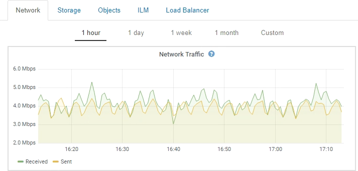

= View the Nodes page
:icons: font
:imagesdir: ../media/

[.lead]
When you need more detailed information about your StorageGRID system than the Dashboard provides, you can use the Nodes page to view metrics for the entire grid, each site in the grid, and each node at a site.

image::../media/nodes_menu.png[Nodes Menu]

From the tree view on the left, you can see all the sites and all the nodes in your StorageGRID system. The icon for each node indicates if the node is connected or if there are any active alerts.

== Connection state icons

If a node is disconnected from the grid, the tree view shows a blue or gray connection state icon, not the icon for any underlying alerts.

* *Unknown* image:../media/icon_alarm_blue_unknown.png[blue question mark icon]: The node is not connected to the grid for an unknown reason. For example, the network connection between nodes has been lost or the power is down. The *Unable to communicate with node* alert might also be triggered. Other alerts might be active as well. This situation requires immediate attention.
+
NOTE: A node might appear as Unknown during managed shutdown operations. You can ignore the Unknown state in these cases.

* *Administratively down* image:../media/icon_alarm_gray_administratively_down.png[gray questionmark icon]: The node is not connected to the grid for an expected reason. For example, the node, or services on the node, has been gracefully shut down, the node is rebooting, or the software is being upgraded. One or more alerts might also be active.

== Alert icons

If a node is connected to the grid, the tree view shows one of the following icons, depending on if there are any current alerts for the node.

* *Critical* image:../media/icon_alert_red_critical.png[Icon Alert Red Critical]: An abnormal condition exists that has stopped the normal operations of a StorageGRID node or service. You must address the underlying issue immediately. Service disruption and loss of data might result if the issue is not resolved.
* *Major* image:../media/icon_alert_orange_major.png[Icon Alert Orange Major]: An abnormal condition exists that is either affecting current operations or approaching the threshold for a critical alert. You should investigate major alerts and address any underlying issues to ensure that the abnormal condition does not stop the normal operation of a StorageGRID node or service.
* *Minor* image:../media/icon_alert_yellow_miinor.png[Icon Alert Yellow Minor]: The system is operating normally, but an abnormal condition exists that could affect the system's ability to operate if it continues. You should monitor and resolve minor alerts that do not clear on their own to ensure they do not result in a more serious problem.
* *Normal* image:../media/icon_alert_green_checkmark.png[icon alert green checkmark]: No alerts are active, and the node is connected to the grid.

== Details for a system, site, or node

To view the available information, click the appropriate links on the left, as follows:

* Select the grid name to see an aggregate summary of the statistics for your entire StorageGRID system. (The screenshot shows a system named StorageGRID Deployment.)
* Select a specific data center site to see an aggregate summary of the statistics for all nodes at that site.
* Select a specific node to view detailed information for that node.

== Tabs for the Nodes page

The tabs at the top of the Nodes page are based on what you select from the tree at the left.

[cols="1a,2a,1a" options="header"]
|===
| Tab name| Description| Included for
a|
Overview
a|

* Provides basic information about each node.
* Shows any current, unacknowledged alarms affecting the node.

a|
All nodes
a|
Hardware
a|

* Displays CPU utilization and memory usage for each node
* For appliance nodes, provides additional hardware information.

a|
All nodes
a|
Network
a|
Displays a graph showing the network traffic received and sent across the network interfaces.
a|
All nodes, each site, and the entire grid
a|
Storage
a|

* Provides details for the disk devices and volumes on each node.
* For Storage Nodes, each site, and the entire grid, includes graphs showing object data storage and metadata storage used over time.

a|
All nodes, each site, and the entire grid
a|
Events
a|
Displays a count of any system error or fault event, including errors such as network errors.
a|
All nodes
a|
Objects
a|

* Provides information about S3 and Swift ingest and retrieve rates.
* For Storage Nodes, provides object counts and information about metadata store queries and background verification.

a|
Storage Nodes, each site, and the entire grid
a|
ILM
a|
Provides information about Information Lifecycle Management (ILM) operations.

* For Storage Nodes, provides details about ILM evaluation and background verification for erasure coded objects.
* For each site and the entire grid, shows a graph of the ILM queue over time.
* For the entire grid, provides the estimated time to complete a full ILM scan of all objects.

a|
Storage Nodes, each site, and the entire grid
a|
Load Balancer
a|
Includes performance and diagnostic graphs related to the Load Balancer service.

* For each site, provides an aggregate summary of the statistics for all nodes at that site.
* For the entire grid, provides an aggregate summary of the statistics for all sites.

a|
Admin Nodes and Gateway Nodes, each site, and the entire grid
a|
Platform Services
a|
Provides information about any S3 platform service operations at a site.
a|
Each site
a|
SANtricity System Manager
a|
Provides access to SANtricity System Manager. From SANtricity System Manager, you can review hardware diagnostic and environmental information for the storage controller, as well as issues related to the drives.
a|
Storage appliance nodes

*Note:* The SANtricity System Manager tab will not appear if the controller firmware on the storage appliance is earlier than 8.70.

|===

== Prometheus metrics

The Prometheus service on Admin Nodes collects time series metrics from the services on all nodes.

The metrics collected by Prometheus are used in a number of places in the Grid Manager:

* *Nodes page*: The graphs and charts on the tabs available from the Nodes page use the Grafana visualization tool to display the time-series metrics collected by Prometheus. Grafana displays time-series data in graph and chart formats, while Prometheus serves as the backend data source.
+

* *Alerts*: Alerts are triggered at specific severity levels when alert rule conditions that use Prometheus metrics evaluate as true.
* *Grid Management API*: You can use Prometheus metrics in custom alert rules or with external automation tools to monitor your StorageGRID system. A complete list of Prometheus metrics is available from the Grid Management API (*Help* > *API Documentation* > *Metrics*). While more than a thousand metrics are available, only a relatively small number are required to monitor the most critical StorageGRID operations.
+
NOTE: Metrics that include _private_ in their names are intended for internal use only and are subject to change between StorageGRID releases without notice.

* The *Support* > *Tools* > *Diagnostics* page and the *Support* > *Tools* > *Metrics* page: These pages, which are primarily intended for use by technical support, provide a number of tools and charts that use the values of Prometheus metrics.
+
NOTE: Some features and menu items within the Metrics page are intentionally non-functional and are subject to change.

== StorageGRID attributes

Attributes report values and statuses for many of the functions of the StorageGRID system. Attribute values are available for each grid node, each site, and the entire grid.

StorageGRID attributes are used in a number of places in the Grid Manager:

* *Nodes page*: Many of the values shown on the Nodes page are StorageGRID attributes. (Prometheus metrics are also shown on the Nodes pages.)
* *Alarms*: When attributes reach defined threshold values, StorageGRID alarms (legacy system) are triggered at specific severity levels.
* *Grid Topology tree*: Attribute values are shown in the Grid Topology tree (*Support* > *Tools* > *Grid Topology*).
* *Events*: System events occur when certain attributes record an error or fault condition for a node, including errors such as network errors.

=== Attribute values

Attributes are reported on a best-effort basis and are approximately correct. Attribute updates can be lost under some circumstances, such as the crash of a service or the failure and rebuild of a grid node.

In addition, propagation delays might slow the reporting of attributes. Updated values for most attributes are sent to the StorageGRID system at fixed intervals. It can take several minutes before an update is visible in the system, and two attributes that change more or less simultaneously can be reported at slightly different times.

.Related information

* xref:../monitor/index.adoc[Monitor & troubleshoot]

* xref:monitoring_and_managing_alerts.adoc[Monitor and manage alerts]

* xref:using_storagegrid_support_options.adoc[Use StorageGRID support options]
