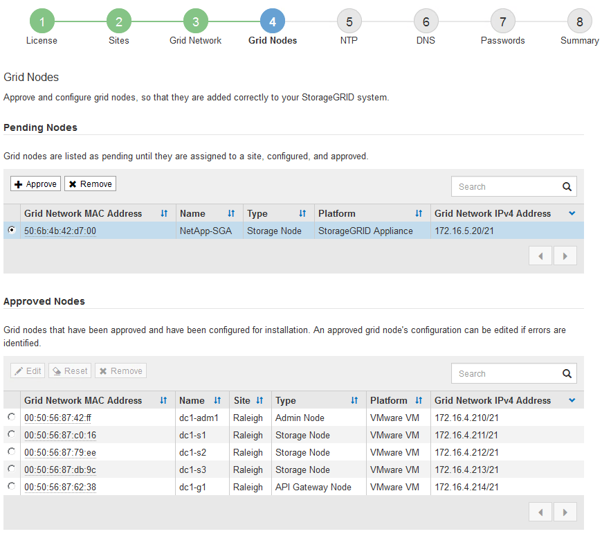
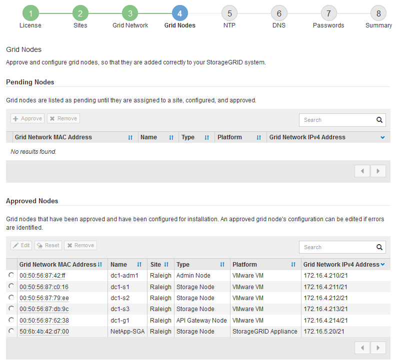

= Approving pending grid nodes
:icons: font
:imagesdir: ../media/

[.lead]
You must approve each grid node before it can join the StorageGRID system.

.What you'll need

All virtual and StorageGRID appliance grid nodes must have been deployed.

.Steps

. Review the Pending Nodes list, and confirm that it shows all of the grid nodes you deployed.
+
NOTE: If a grid node is missing, confirm that it was deployed successfully.

. Select the radio button next to a pending node you want to approve.
+

. Click *Approve*.
. In General Settings, modify settings for the following properties, as necessary:
+
image::../media/6_gmi_installer_node_config_popup.gif[This image is explained by the surrounding text.]

 ** *Site*: The name of the site with which this grid node will be associated.
 ** *Name*: The name that will be assigned to the node, and the name that will be displayed in the Grid Manager. The name defaults to the name you specified when you configured the node. During this step of the installation process, you can change the name as required.
+
IMPORTANT: After you complete the installation, you cannot change the name of the node.
+
NOTE: For a VMware node, you can change the name here, but this action will not change the name of the virtual machine in vSphere.

 ** *NTP Role*: The Network Time Protocol (NTP) role of the grid node. The options are *Automatic*, *Primary*, and *Client*. Selecting *Automatic* assigns the Primary role to Admin Nodes, Storage Nodes with ADC services, Gateway Nodes, and any grid nodes that have non-static IP addresses. All other grid nodes are assigned the Client role.
+
IMPORTANT: Make sure that at least two nodes at each site can access at least four external NTP sources. If only one node at a site can reach the NTP sources, timing issues will occur if that node goes down. In addition, designating two nodes per site as primary NTP sources ensures accurate timing if a site is isolated from the rest of the grid.

 ** *ADC service* (Storage Nodes only): Select *Automatic* to let the system determine whether the node requires the Administrative Domain Controller (ADC) service. The ADC service keeps track of the location and availability of grid services. At least three Storage Nodes at each site must include the ADC service. You cannot add the ADC service to a node after it is deployed.

. In Grid Network, modify settings for the following properties as necessary:
 ** *IPv4 Address (CIDR)*: The CIDR network address for the Grid Network interface (eth0 inside the container). For example: 192.168.1.234/21
 ** *Gateway*: The Grid Network gateway. For example: 192.168.0.1
+
The gateway is required if there are multiple grid subnets.

+
NOTE: If you selected DHCP for the Grid Network configuration and you change the value here, the new value will be configured as a static address on the node. You must make sure the resulting IP address is not within a DHCP address pool.
. If you want to configure the Admin Network for the grid node, add or update the settings in the Admin Network section as necessary.
+
Enter the destination subnets of the routes out of this interface in the *Subnets (CIDR)* text box. If there are multiple Admin subnets, the Admin gateway is required.
+
NOTE: If you selected DHCP for the Admin Network configuration and you change the value here, the new value will be configured as a static address on the node. You must make sure the resulting IP address is not within a DHCP address pool.
+
*Appliances:* For a StorageGRID appliance, if the Admin Network was not configured during the initial installation using the StorageGRID Appliance Installer, it cannot be configured in this Grid Manager dialog box. Instead, you must follow these steps:

 .. Reboot the appliance: In the Appliance Installer, select *Advanced* > *Reboot*.
+
Rebooting can take several minutes.

 .. Select *Configure Networking* > *Link Configuration* and enable the appropriate networks.
 .. Select *Configure Networking* > *IP Configuration* and configure the enabled networks.
 .. Return to the Home page and click *Start Installation*.
 .. In the Grid Manager: If the node is listed in the Approved Nodes table, reset the node.
 .. Remove the node from the Pending Nodes table.
 .. Wait for the node to reappear in the Pending Nodes list.
 .. Confirm that you can configure the appropriate networks. They should already be populated with the information you provided on the IP Configuration page.
+
For additional information, see the installation and maintenance instructions for your appliance model.

. If you want to configure the Client Network for the grid node, add or update the settings in the Client Network section as necessary. If the Client Network is configured, the gateway is required, and it becomes the default gateway for the node after installation.
+
NOTE: If you selected DHCP for the Client Network configuration and you change the value here, the new value will be configured as a static address on the node. You must make sure the resulting IP address is not within a DHCP address pool.
+
*Appliances:* For a StorageGRID appliance, if the Client Network was not configured during the initial installation using the StorageGRID Appliance Installer, it cannot be configured in this Grid Manager dialog box. Instead, you must follow these steps:

 .. Reboot the appliance: In the Appliance Installer, select *Advanced* > *Reboot*.
+
Rebooting can take several minutes.

 .. Select *Configure Networking* > *Link Configuration* and enable the appropriate networks.
 .. Select *Configure Networking* > *IP Configuration* and configure the enabled networks.
 .. Return to the Home page and click *Start Installation*.
 .. In the Grid Manager: If the node is listed in the Approved Nodes table, reset the node.
 .. Remove the node from the Pending Nodes table.
 .. Wait for the node to reappear in the Pending Nodes list.
 .. Confirm that you can configure the appropriate networks. They should already be populated with the information you provided on the IP Configuration page.
+
For additional information, see the installation and maintenance instructions for your appliance.

. Click *Save*.
+
The grid node entry moves to the Approved Nodes list.
+

. Repeat these steps for each pending grid node you want to approve.
+
You must approve all nodes that you want in the grid. However, you can return to this page at any time before you click *Install* on the Summary page. You can modify the properties of an approved grid node by selecting its radio button and clicking *Edit*.

. When you are done approving grid nodes, click *Next*.
