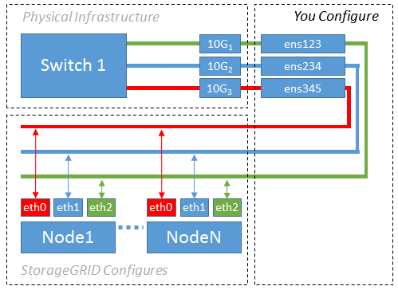

= Example 1: 1-to-1 mapping to physical or virtual NICs
:icons: font
:imagesdir: ../media/

[.lead]
Example 1 describes a simple physical interface mapping that requires little or no host-side configuration.

The Linux operating system creates the `ensXYZ` interfaces automatically during installation or boot, or when the interfaces are hot-added. No configuration is required other than ensuring that the interfaces are set to come up automatically after boot. You do have to determine which `ensXYZ` corresponds to which StorageGRID network (Grid, Admin, or Client) so you can provide the correct mappings later in the configuration process.

Note that the figure show multiple StorageGRID nodes; however, you would normally use this configuration for single-node VMs.

If Switch 1 is a physical switch, you should configure the ports connected to interfaces 10G1 through 10G3 for access mode, and place them on the appropriate VLANs.
