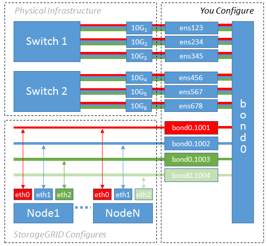

= Example 2: LACP bond carrying VLANs
:icons: font
:imagesdir: ../media/

.About this task

Example 2 assumes you are familiar with bonding network interfaces and with creating VLAN interfaces on the Linux distribution you are using.

Example 2 describes a generic, flexible, VLAN-based scheme that facilitates the sharing of all available network bandwidth across all nodes on a single host. This example is particularly applicable to bare metal hosts.

To understand this example, suppose you have three separate subnets for the Grid, Admin, and Client Networks at each data center. The subnets are on separate VLANs (1001, 1002, and 1003) and are presented to the host on a LACP-bonded trunk port (bond0). You would configure three VLAN interfaces on the bond: bond0.1001, bond0.1002, and bond0.1003.

If you require separate VLANs and subnets for node networks on the same host, you can add VLAN interfaces on the bond and map them into the host (shown as bond0.1004 in the illustration).

.Steps

. Aggregate all physical network interfaces that will be used for StorageGRID network connectivity into a single LACP bond.
+
Use the same name for the bond on every host, for example, bond0.

. Create VLAN interfaces that use this bond as their associated "`physical device,`" using the standard VLAN interface naming convention `physdev-name.VLAN ID`.
+
Note that steps 1 and 2 require appropriate configuration on the edge switches terminating the other ends of the network links. The edge switch ports must also be aggregated into a LACP port channel, configured as a trunk, and allowed to pass all required VLANs.
+
Sample interface configuration files for this per-host networking configuration scheme are provided.

.Related information

xref:example-etc-sysconfig-network-scripts.adoc[Example /etc/sysconfig/network-scripts]
