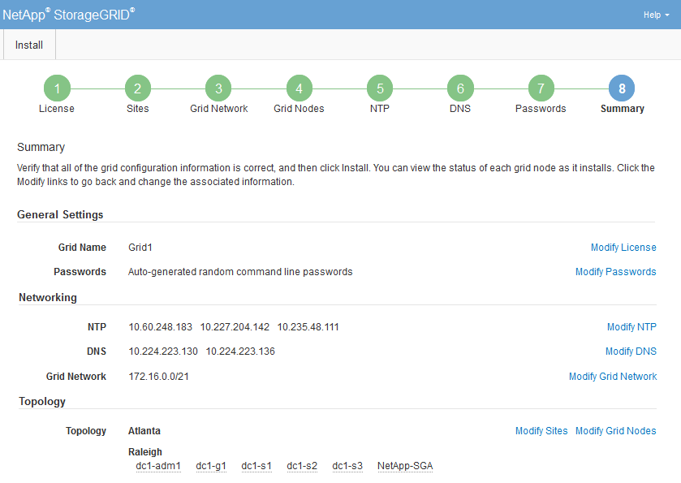
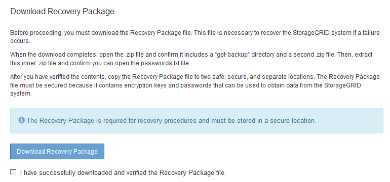

= Reviewing your configuration and completing installation
:icons: font
:imagesdir: ../media/

[.lead]
You must carefully review the configuration information you have entered to ensure that the installation completes successfully.

.Steps

. View the *Summary* page.
+

. Verify that all of the grid configuration information is correct. Use the Modify links on the Summary page to go back and correct any errors.
. Click *Install*.
+
NOTE: If a node is configured to use the Client Network, the default gateway for that node switches from the Grid Network to the Client Network when you click *Install*. If you lose connectivity, you must ensure that you are accessing the primary Admin Node through an accessible subnet. See xref:../network/index.adoc[Networking guidelines] for details.

. Click *Download Recovery Package*.
+
When the installation progresses to the point where the grid topology is defined, you are prompted to download the Recovery Package file (`.zip`), and confirm that you can successfully access the contents of this file. You must download the Recovery Package file so that you can recover the StorageGRID system if one or more grid nodes fail. The installation continues in the background, but you cannot complete the installation and access the StorageGRID system until you download and verify this file.

. Verify that you can extract the contents of the `.zip` file, and then save it in two safe, secure, and separate locations.
+
IMPORTANT: The Recovery Package file must be secured because it contains encryption keys and passwords that can be used to obtain data from the StorageGRID system.

. Select the *I have successfully downloaded and verified the Recovery Package file* check box, and click *Next*.
+

+
If the installation is still in progress, the status page appears. This page indicates the progress of the installation for each grid node.
+
image::../media/12_gmi_installer_status_page.gif[This image is explained by the surrounding text.]
+
When the Complete stage is reached for all grid nodes, the sign-in page for the Grid Manager appears.

. Sign in to the Grid Manager using the "root" user and the password you specified during the installation.
