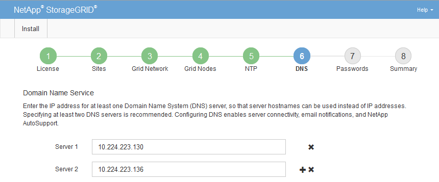

= Specifying Domain Name System server information
:icons: font
:imagesdir: ../media/

[.lead]
You must specify Domain Name System (DNS) information for your StorageGRID system, so that you can access external servers using hostnames instead of IP addresses.

.About this task

Specifying DNS server information allows you to use Fully Qualified Domain Name (FQDN) hostnames rather than IP addresses for email notifications and AutoSupport. Specifying at least two DNS servers is recommended.

IMPORTANT: Provide two to six IPv4 addresses for DNS servers. You should select DNS servers that each site can access locally in the event of network islanding. This is to ensure an islanded site continues to have access to the DNS service. After configuring the grid-wide DNS server list, you can further customize the DNS server list for each node. For details, see the information about modifying the DNS configuration in the recovery and maintenance instructions.

If the DNS server information is omitted or incorrectly configured, a DNST alarm is triggered on each grid node's SSM service. The alarm clears when DNS is configured correctly and the new server information has reached all grid nodes.

.Steps

. Specify the IPv4 address for at least one DNS server in the *Server 1* text box.
. If necessary, select the plus sign next to the last entry to add additional server entries.
+

+
The best practice is to specify at least two DNS servers. You can specify up to six DNS servers.

. Select *Next*.
