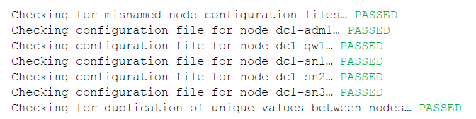
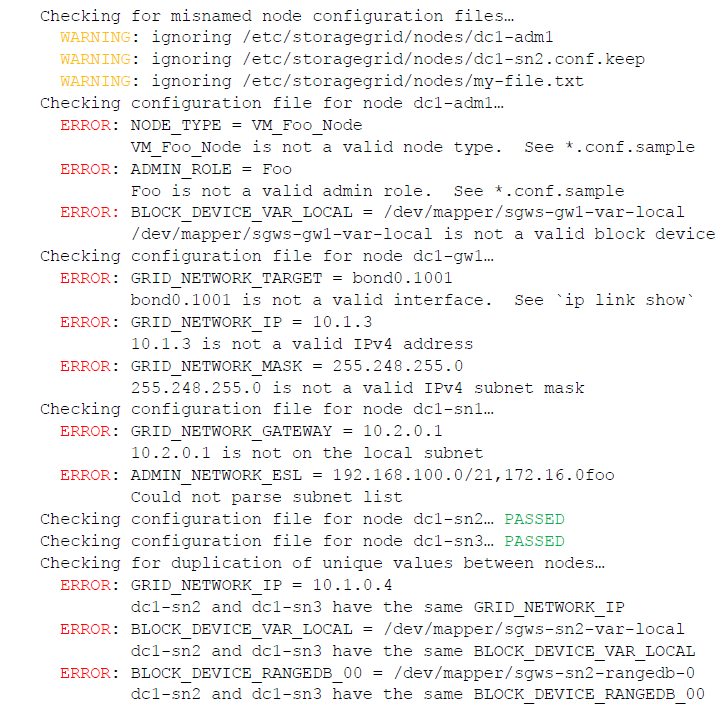

= Validating the StorageGRID configuration
:icons: font
:imagesdir: ../media/

[.lead]
After creating configuration files in `/etc/storagegrid/nodes` for each of your StorageGRID nodes, you must validate the contents of those files.

To validate the contents of the configuration files, run the following command on each host:

----
sudo storagegrid node validate all
----

If the files are correct, the output shows *PASSED* for each configuration file, as shown in the example.

TIP: For an automated installation, you can suppress this output by using the `-q` or `--quiet` options in the `storagegrid` command (for example, `storagegrid --quiet...`). If you suppress the output, the command will have a non-zero exit value if any configuration warnings or errors were detected.

If the configuration files are incorrect, the issues are shown as *WARNING* and *ERROR*, as shown in the example. If any configuration errors are found, you must correct them before you continue with the installation.

