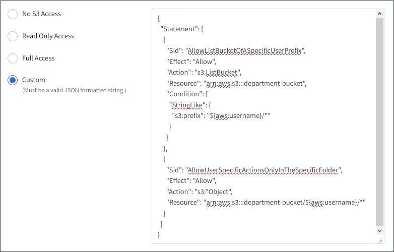

= Bucket and group access policies
:icons: font
:imagesdir: ../media/

[.lead]
StorageGRID uses the Amazon Web Services (AWS) policy language to allow S3 tenants to control access to buckets and objects within those buckets. The StorageGRID system implements a subset of the S3 REST API policy language. Access policies for the S3 API are written in JSON.

== Access policy overview

[.lead]
There are two kinds of access policies supported by StorageGRID.

* *Bucket policies*, which are configured using the GET Bucket policy, PUT Bucket policy, and DELETE Bucket policy S3 API operations. Bucket policies are attached to buckets, so they are configured to control access by users in the bucket owner account or other accounts to the bucket and the objects in it. A bucket policy applies to only one bucket and possibly multiple groups.
* *Group policies*, which are configured using the Tenant Manager or Tenant Management API. Group policies are attached to a group in the account, so they are configured to allow that group to access specific resources owned by that account. A group policy applies to only one group and possibly multiple buckets.

StorageGRID bucket and group policies follow a specific grammar defined by Amazon. Inside each policy is an array of policy statements, and each statement contains the following elements:

* Statement ID (Sid) (optional)
* Effect
* Principal/NotPrincipal
* Resource/NotResource
* Action/NotAction
* Condition (optional)

Policy statements are built using this structure to specify permissions: Grant <Effect> to allow/deny <Principal> to perform <Action> on <Resource> when <Condition> applies.

Each policy element is used for a specific function:

[options="header"]
|===
| Element| Description
a|
Sid
a|
The Sid element is optional. The Sid is only intended as a description for the user. It is stored but not interpreted by the StorageGRID system.
a|
Effect
a|
Use the Effect element to establish whether the specified operations are allowed or denied. You must identify operations you allow (or deny) on buckets or objects using the supported Action element keywords.
a|
Principal/NotPrincipal
a|
You can allow users, groups, and accounts to access specific resources and perform specific actions. If no S3 signature is included in the request, anonymous access is allowed by specifying the wildcard character (*) as the principal. By default, only the account root has access to resources owned by the account.

You only need to specify the Principal element in a bucket policy. For group policies, the group to which the policy is attached is the implicit Principal element.

a|
Resource/NotResource
a|
The Resource element identifies buckets and objects. You can allow or deny permissions to buckets and objects using the Amazon Resource Name (ARN) to identify the resource.
a|
Action/NotAction
a|
The Action and Effect elements are the two components of permissions. When a group requests a resource, they are either granted or denied access to the resource. Access is denied unless you specifically assign permissions, but you can use explicit deny to override a permission granted by another policy.
a|
Condition
a|
The Condition element is optional. Conditions allow you to build expressions to determine when a policy should be applied.
|===
In the Action element, you can use the wildcard character (*) to specify all operations, or a subset of operations. For example, this Action matches permissions such as s3:GetObject, s3:PutObject, and s3:DeleteObject.

----
s3:*Object
----

In the Resource element, you can use the wildcard characters (\*) and (?). While the asterisk (*) matches 0 or more characters, the question mark (?) matches any single character.

In the Principal element, wildcard characters are not supported except to set anonymous access, which grants permission to everyone. For example, you set the wildcard (*) as the Principal value.

----
"Principal":"*"
----

In the following example, the statement is using the Effect, Principal, Action, and Resource elements. This example shows a complete bucket policy statement that uses the Effect "Allow" to give the Principals, the admin group `federated-group/admin` and the finance group `federated-group/finance`, permissions to perform the Action `s3:ListBucket` on the bucket named `mybucket` and the Action `s3:GetObject` on all objects inside that bucket.

----
{
  "Statement": [
    {
      "Effect": "Allow",
      "Principal": {
        "AWS": [
          "arn:aws:iam::27233906934684427525:federated-group/admin",
          "arn:aws:iam::27233906934684427525:federated-group/finance"
        ]
      },
      "Action": [
        "s3:ListBucket",
        "s3:GetObject"
      ],
      "Resource": [
        "arn:aws:iam:s3:::mybucket",
        "arn:aws:iam:s3:::mybucket/*"
      ]
    }
  ]
}
----

The bucket policy has a size limit of 20,480 bytes, and the group policy has a size limit of 5,120 bytes.

.Related information

xref:../tenant/index.adoc[Use a tenant account]

== Consistency control settings for policies

[.lead]
By default, any updates you make to group policies are eventually consistent. Once a group policy becomes consistent, the changes can take an additional 15 minutes to take effect, because of policy caching. By default, any updates you make to bucket policies are also eventually consistent.

As required, you can change the consistency guarantees for bucket policy updates. For example, you might want a change to a bucket policy to become effective as soon as possible for security reasons.

In this case, you can either set the `Consistency-Control` header in the PUT Bucket policy request, or you can use the PUT Bucket consistency request. When changing the consistency control for this request, you must use the value *all*, which provides the highest guarantee of read-after-write consistency. If you specify any other consistency control value in a header for the PUT Bucket consistency request, the request will be rejected. If you specify any other value for a PUT Bucket policy request, the value will be ignored. Once a bucket policy becomes consistent, the changes can take an additional 8 seconds to take effect, because of policy caching.

NOTE: If you set the consistency level to *all* to force a new bucket policy to become effective sooner, be sure to set the bucket-level control back to its original value when you are done. Otherwise, all future bucket requests will use the *all* setting.

== Using the ARN in policy statements

[.lead]
In policy statements, the ARN is used in Principal and Resource elements.

* Use this syntax to specify the S3 resource ARN:
+
[source]
[subs="specialcharacters,quotes"]
----
arn:aws:s3:::bucket-name
arn:aws:s3:::bucket-name/object_key
----

* Use this syntax to specify the identity resource ARN (users and groups):
+
[source]
[subs="specialcharacters,quotes"]
----
arn:aws:iam::account_id:root
arn:aws:iam::account_id:user/user_name
arn:aws:iam::account_id:group/group_name
arn:aws:iam::account_id:federated-user/user_name
arn:aws:iam::account_id:federated-group/group_name
----

Other considerations:

* You can use the asterisk (*) as a wildcard to match zero or more characters inside the object key.
* International characters, which can be specified in the object key, should be encoded using JSON UTF-8 or using JSON \u escape sequences. Percent-encoding is not supported.
+
https://www.ietf.org/rfc/rfc2141.txt[RFC 2141 URN Syntax]
+
The HTTP request body for the PUT Bucket policy operation must be encoded with charset=UTF-8.

== Specifying resources in a policy

[.lead]
In policy statements, you can use the Resource element to specify the bucket or object for which permissions are allowed or denied.

* Each policy statement requires a Resource element. In a policy, resources are denoted by the element `Resource`, or alternatively, `NotResource` for exclusion.
* You specify resources with an S3 resource ARN. For example:
+
----
"Resource": "arn:aws:s3:::mybucket/*"
----

* You can also use policy variables inside the object key. For example:
+
----
"Resource": "arn:aws:s3:::mybucket/home/${aws:username}/*"
----

* The resource value can specify a bucket that does not yet exist when a group policy is created.

.Related information

xref:bucket-and-group-access-policies.adoc[Specifying variables in a policy]

== Specifying principals in a policy

[.lead]
Use the Principal element to identity the user, group, or tenant account that is allowed/denied access to the resource by the policy statement.

* Each policy statement in a bucket policy must include a Principal element. Policy statements in a group policy do not need the Principal element because the group is understood to be the principal.
* In a policy, principals are denoted by the element "`Principal,`" or alternatively "`NotPrincipal`" for exclusion.
* Account-based identities must be specified using an ID or an ARN:
+
----
"Principal": { "AWS": "account_id"}
"Principal": { "AWS": "identity_arn" }
----

* This example uses the tenant account ID 27233906934684427525, which includes the account root and all users in the account:
+
----
 "Principal": { "AWS": "27233906934684427525" }
----

* You can specify just the account root:
+
----
"Principal": { "AWS": "arn:aws:iam::27233906934684427525:root" }
----

* You can specify a specific federated user ("Alex"):
+
----
"Principal": { "AWS": "arn:aws:iam::27233906934684427525:federated-user/Alex" }
----

* You can specify a specific federated group ("Managers"):
+
----
"Principal": { "AWS": "arn:aws:iam::27233906934684427525:federated-group/Managers"  }
----

* You can specify an anonymous principal:
+
----
"Principal": "*"
----

* To avoid ambiguity, you can use the user UUID instead of the username:
+
----
arn:aws:iam::27233906934684427525:user-uuid/de305d54-75b4-431b-adb2-eb6b9e546013
----
+
For example, suppose Alex leaves the organization and the username `Alex` is deleted. If a new Alex joins the organization and is assigned the same `Alex` username, the new user might unintentionally inherit the permissions granted to the original user.

* The principal value can specify a group/user name that does not yet exist when a bucket policy is created.

== Specifying permissions in a policy

[.lead]
In a policy, the Action element is used to allow/deny permissions to a resource. There are a set of permissions that you can specify in a policy, which are denoted by the element "Action," or alternatively, "NotAction" for exclusion. Each of these elements maps to specific S3 REST API operations.

The tables lists the permissions that apply to buckets and the permissions that apply to objects.

NOTE: Amazon S3 now uses the s3:PutReplicationConfiguration permission for both the PUT and DELETE Bucket replication actions. StorageGRID uses separate permissions for each action, which matches the original Amazon S3
specification.

NOTE: A DELETE is performed when a PUT is used to overwrite an existing value.

=== Permissions that apply to buckets

[options="header"]
|===
| Permissions| S3 REST API operations| Custom for StorageGRID
a|
s3:CreateBucket
a|
PUT Bucket
a|

a|
s3:DeleteBucket
a|
DELETE Bucket
a|

a|
s3:DeleteBucketMetadataNotification
a|
DELETE Bucket metadata notification configuration
a|
Yes
a|
s3:DeleteBucketPolicy
a|
DELETE Bucket policy
a|

a|
s3:DeleteReplicationConfiguration
a|
DELETE Bucket replication
a|
Yes, separate permissions for PUT and DELETE*
a|
s3:GetBucketAcl
a|
GET Bucket ACL
a|

a|
s3:GetBucketCompliance
a|
GET Bucket compliance (deprecated)
a|
Yes
a|
s3:GetBucketConsistency
a|
GET Bucket consistency
a|
Yes
a|
s3:GetBucketCORS
a|
GET Bucket cors
a|

a|
s3:GetEncryptionConfiguration
a|
GET Bucket encryption
a|

a|
s3:GetBucketLastAccessTime
a|
GET Bucket last access time
a|
Yes
a|
s3:GetBucketLocation
a|
GET Bucket location
a|

a|
s3:GetBucketMetadataNotification
a|
GET Bucket metadata notification configuration
a|
Yes
a|
s3:GetBucketNotification
a|
GET Bucket notification
a|

a|
s3:GetBucketObjectLockConfiguration
a|
GET Object Lock Configuration
a|

a|
s3:GetBucketPolicy
a|
GET Bucket policy
a|

a|
s3:GetBucketTagging
a|
GET Bucket tagging
a|

a|
s3:GetBucketVersioning
a|
GET Bucket versioning
a|

a|
s3:GetLifecycleConfiguration
a|
GET Bucket lifecycle
a|

a|
s3:GetReplicationConfiguration
a|
GET Bucket replication
a|

a|
s3:ListAllMyBuckets
a|

* GET Service
* GET Storage Usage

a|
Yes, for GET Storage Usage
a|
s3:ListBucket
a|

* GET Bucket (List Objects)
* HEAD Bucket
* POST Object restore

a|

a|
s3:ListBucketMultipartUploads
a|

* List Multipart Uploads
* POST Object restore

a|

a|
s3:ListBucketVersions
a|
GET Bucket versions
a|

a|
s3:PutBucketCompliance
a|
PUT Bucket compliance (deprecated)
a|
Yes
a|
s3:PutBucketConsistency
a|
PUT Bucket consistency
a|
Yes
a|
s3:PutBucketCORS
a|

* DELETE Bucket cors†
* PUT Bucket cors

a|

a|
s3:PutEncryptionConfiguration
a|

* DELETE Bucket encryption
* PUT Bucket encryption

a|

a|
s3:PutBucketLastAccessTime
a|
PUT Bucket last access time
a|
Yes
a|
s3:PutBucketMetadataNotification
a|
PUT Bucket metadata notification configuration
a|
Yes
a|
s3:PutBucketNotification
a|
PUT Bucket notification
a|

a|
s3:PutBucketObjectLockConfiguration
a|
PUT Bucket with the `x-amz-bucket-object-lock-enabled: true` request header (also requires the s3:CreateBucket permission)
a|

a|
s3:PutBucketPolicy
a|
PUT Bucket policy
a|

a|
s3:PutBucketTagging
a|

* DELETE Bucket tagging†
* PUT Bucket tagging

a|

a|
s3:PutBucketVersioning
a|
PUT Bucket versioning
a|

a|
s3:PutLifecycleConfiguration
a|

* DELETE Bucket lifecycle†
* PUT Bucket lifecycle

a|

a|
s3:PutReplicationConfiguration
a|
PUT Bucket replication
a|
Yes, separate permissions for PUT and DELETE*
a|
* Amazon S3 now uses the s3:PutReplicationConfiguration permission for both the PUT and DELETE Bucket replication actions. StorageGRID uses separate permissions for each action, which matches the original Amazon S3 specification.
a|
† A DELETE is performed when a PUT is used to overwrite an existing value.
|===

=== Permissions that apply to objects

[options="header"]
|===
| Permissions| S3 REST API operations| Custom for StorageGRID
a|
s3:AbortMultipartUpload
a|

* Abort Multipart Upload
* POST Object restore

a|

a|
s3:DeleteObject
a|

* DELETE Object
* DELETE Multiple Objects
* POST Object restore

a|

a|
s3:DeleteObjectTagging
a|
DELETE Object Tagging
a|

a|
s3:DeleteObjectVersionTagging
a|
DELETE Object Tagging (a specific version of the object)
a|

a|
s3:DeleteObjectVersion
a|
DELETE Object (a specific version of the object)
a|

a|
s3:GetObject
a|

* GET Object
* HEAD Object
* POST Object restore

a|

a|
s3:GetObjectAcl
a|
GET Object ACL
a|

a|
s3:GetObjectLegalHold
a|
GET Object legal hold
a|

a|
s3:GetObjectRetention
a|
GET Object retention
a|

a|
s3:GetObjectTagging
a|
GET Object Tagging
a|

a|
s3:GetObjectVersionTagging
a|
GET Object Tagging (a specific version of the object)
a|

a|
s3:GetObjectVersion
a|
GET Object (a specific version of the object)
a|

a|
s3:ListMultipartUploadParts
a|
List Parts, POST Object restore
a|

a|
s3:PutObject
a|

* PUT Object
* PUT Object - Copy
* POST Object restore
* Initiate Multipart Upload
* Complete Multipart Upload
* Upload Part
* Upload Part - Copy

a|

a|
s3:PutObjectLegalHold
a|
PUT Object legal hold
a|

a|
s3:PutObjectRetention
a|
PUT Object retention
a|

a|
s3:PutObjectTagging
a|
PUT Object Tagging
a|

a|
s3:PutObjectVersionTagging
a|
PUT Object Tagging (a specific version of the object)
a|

a|
s3:PutOverwriteObject
a|

* PUT Object
* PUT Object - Copy
* PUT Object tagging
* DELETE Object tagging
* Complete Multipart Upload

a|
Yes
a|
s3:RestoreObject
a|
POST Object restore
a|

|===

== Using the PutOverwriteObject permission

[.lead]
The s3:PutOverwriteObject permission is a custom StorageGRID permission that applies to operations that create or update objects. The setting of this permission determines whether the client can overwrite an object's data, user-defined metadata, or S3 object tagging.

Possible settings for this permission include:

* *Allow*: The client can overwrite an object. This is the default setting.
* *Deny*: The client cannot overwrite an object. When set to Deny, the PutOverwriteObject permission works as follows:
 ** If an existing object is found at the same path:
  *** The object's data, user-defined metadata, or S3 object tagging cannot be overwritten.
  *** Any ingest operations in progress are cancelled, and an error is returned.
  *** If S3 versioning is enabled, the Deny setting prevents PUT Object tagging or DELETE Object tagging operations from modifying the TagSet for an object and its noncurrent versions.
 ** If an existing object is not found, this permission has no effect.
* When this permission is not present, the effect is the same as if Allow were set.

IMPORTANT: If the current S3 policy allows overwrite, and the PutOverwriteObject permission is set to Deny, the client cannot overwrite an object's data, user-defined metadata, or object tagging. In addition, if the *Prevent Client Modification* check box is selected (*Configuration* > *Grid Options*), that setting overrides the setting of the PutOverwriteObject permission.

.Related information

xref:bucket-and-group-access-policies.adoc[S3 group policy examples]

== Specifying conditions in a policy

[.lead]
Conditions define when a policy will be in effect. Conditions consist of operators and key-value pairs.

Conditions use key-value pairs for evaluation. A Condition element can contain multiple conditions, and each condition can contain multiple key-value pairs. The condition block uses the following format:

[source]
[subs="specialcharacters,quotes"]
----
Condition: {
     _condition_type_: {
          _condition_key_: _condition_values_
----

In the following example, the IpAddress condition uses the SourceIp condition key.

----
"Condition": {
    "IpAddress": {
      "aws:SourceIp": "54.240.143.0/24"
		...
},
		...
----

=== Supported condition operators

Condition operators are categorized as follows:

* String
* Numeric
* Boolean
* IP address
* Null check

[options="header"]
|===
| Condition operators| Description
a|
StringEquals
a|
Compares a key to a string value based on exact matching (case sensitive).
a|
StringNotEquals
a|
Compares a key to a string value based on negated matching (case sensitive).
a|
StringEqualsIgnoreCase
a|
Compares a key to a string value based on exact matching (ignores case).
a|
StringNotEqualsIgnoreCase
a|
Compares a key to a string value based on negated matching (ignores case).
a|
StringLike
a|
Compares a key to a string value based on exact matching (case sensitive). Can include * and ? wildcard characters.
a|
StringNotLike
a|
Compares a key to a string value based on negated matching (case sensitive). Can include * and ? wildcard characters.
a|
NumericEquals
a|
Compares a key to a numeric value based on exact matching.
a|
NumericNotEquals
a|
Compares a key to a numeric value based on negated matching.
a|
NumericGreaterThan
a|
Compares a key to a numeric value based on "`greater than`" matching.
a|
NumericGreaterThanEquals
a|
Compares a key to a numeric value based on "`greater than or equals`" matching.
a|
NumericLessThan
a|
Compares a key to a numeric value based on "`less than`" matching.
a|
NumericLessThanEquals
a|
Compares a key to a numeric value based on "`less than or equals`" matching.
a|
Bool
a|
Compares a key to a Boolean value based on "`true or false`" matching.
a|
IpAddress
a|
Compares a key to an IP address or range of IP addresses.
a|
NotIpAddress
a|
Compares a key to an IP address or range of IP addresses based on negated matching.
a|
Null
a|
Checks if a condition key is present in the current request context.
|===

=== Supported condition keys

[options="header"]
|===
| Category| Applicable condition keys| Description
a|
IP operators
a|
aws:SourceIp
a|
Will compare to the IP address from which the request was sent. Can be used for bucket or object operations.

*Note:* If the S3 request was sent through the Load Balancer service on Admin Nodes and Gateways Nodes, this will compare to the IP address upstream of the Load Balancer service.

*Note*: If a third-party, non-transparent load balancer is used, this will compare to the IP address of that load balancer. Any `X-Forwarded-For` header will be ignored since its validity cannot be ascertained.

a|
Resource/Identity
a|
aws:username
a|
Will compare to the sender's username from which the request was sent. Can be used for bucket or object operations.
a|
S3:ListBucket and

S3:ListBucketVersions permissions

a|
s3:delimiter
a|
Will compare to the delimiter parameter specified in a GET Bucket or GET Bucket Object versions request.
a|
S3:ListBucket and

S3:ListBucketVersions permissions
a|
s3:max-keys
a|
Will compare to the max-keys parameter specified in a GET Bucket or GET Bucket Object versions request.
a|
S3:ListBucket and

S3:ListBucketVersions permissions
a|
s3:prefix
a|
Will compare to the prefix parameter specified in a GET Bucket or GET Bucket Object versions request.
|===

== Specifying variables in a policy

[.lead]
You can use variables in policies to populate policy information when it is available. You can use policy variables in the `Resource` element and in string comparisons in the `Condition` element.

In this example, the variable `${aws:username}` is part of the Resource element:

[source]
[subs="specialcharacters,quotes"]
----
"Resource": "arn:aws:s3:::_bucket-name/home_/${aws:username}/*"
----

In this example, the variable `${aws:username}` is part of the condition value in the condition block:

----
"Condition": {
    "StringLike": {
      "s3:prefix": "${aws:username}/*"
		...
},
		...
----

[options="header"]
|===
| Variable| Description
a|
`${aws:SourceIp}`
a|
Uses the SourceIp key as the provided variable.
a|
`${aws:username}`
a|
Uses the username key as the provided variable.
a|
`${s3:prefix}`
a|
Uses the service-specific prefix key as the provided variable.
a|
`${s3:max-keys}`
a|
Uses the service-specific max-keys key as the provided variable.
a|
`${*}`
a|
Special character. Uses the character as a literal * character.
a|
`${?}`
a|
Special character. Uses the character as a literal ? character.
a|
`${$}`
a|
Special character. Uses the character as a literal $ character.
|===

== Creating policies requiring special handling

[.lead]
Sometimes a policy can grant permissions that are dangerous for security or dangerous for continued operations, such as locking out the root user of the account. The StorageGRID S3 REST API implementation is less restrictive during policy validation than Amazon, but equally strict during policy evaluation.

[options="header"]
|===
| Policy description| Policy type| Amazon behavior| StorageGRID behavior
a|
Deny self any permissions to the root account
a|
Bucket
a|
Valid and enforced, but root user account retains permission for all S3 bucket policy operations
a|
Same
a|
Deny self any permissions to user/group
a|
Group
a|
Valid and enforced
a|
Same
a|
Allow a foreign account group any permission
a|
Bucket
a|
Invalid principal
a|
Valid, but permissions for all S3 bucket policy operations return a 405 Method Not Allowed error when allowed by a policy
a|
Allow a foreign account root or user any permission
a|
Bucket
a|
Valid, but permissions for all S3 bucket policy operations return a 405 Method Not Allowed error when allowed by a policy
a|
Same
a|
Allow everyone permissions to all actions
a|
Bucket
a|
Valid, but permissions for all S3 bucket policy operations return a 405 Method Not Allowed error for the foreign account root and users
a|
Same
a|
Deny everyone permissions to all actions
a|
Bucket
a|
Valid and enforced, but root user account retains permission for all S3 bucket policy operations
a|
Same
a|
Principal is a non-existent user or group
a|
Bucket
a|
Invalid principal
a|
Valid
a|
Resource is a non-existent S3 bucket
a|
Group
a|
Valid
a|
Same
a|
Principal is a local group
a|
Bucket
a|
Invalid principal
a|
Valid
a|
Policy grants a non-owner account (including anonymous accounts) permissions to PUT objects
a|
Bucket
a|
Valid. Objects are owned by the creator account, and the bucket policy does not apply. The creator account must grant access permissions for the object using object ACLs.
a|
Valid. Objects are owned by the bucket owner account. Bucket policy applies.
|===

== Write-once-read-many (WORM) protection

[.lead]
You can create write-once-read-many (WORM) buckets to protect data, user-defined object metadata, and S3 object tagging. You configure the WORM buckets to allow the creation of new objects and to prevent overwrites or deletion of existing content. Use one of the approaches described here.

To ensure that overwrites are always denied, you can:

* From the Grid Manager, go to *Configuration* > *Grid Options*, and select the *Prevent Client Modification* check box.
* Apply the following rules and S3 policies:
 ** Add a PutOverwriteObject DENY operation to the S3 policy.
 ** Add a DeleteObject DENY operation to the S3 policy.
 ** Add a PUT Object ALLOW operation to the S3 policy.

IMPORTANT: Setting DeleteObject to DENY in an S3 policy does not prevent ILM from deleting objects when a rule such as "`zero copies after 30 days`" exists.

IMPORTANT: Even when all of these rules and policies are applied, they do not guard against concurrent writes (see Situation A). They do guard against sequential completed overwrites (see Situation B).

*Situation A*: Concurrent writes (not guarded against)

----
/mybucket/important.doc
PUT#1 ---> OK
PUT#2 -------> OK
----

*Situation B*: Sequential completed overwrites (guarded against)

----
/mybucket/important.doc
PUT#1 -------> PUT#2 ---X (denied)
----

.Related information

xref:../ilm/index.adoc[Manage objects with ILM]

xref:bucket-and-group-access-policies.adoc[Creating policies requiring special handling]

xref:how-storagegrid-ilm-rules-manage-objects.adoc[How StorageGRID ILM rules manage objects]

xref:bucket-and-group-access-policies.adoc[S3 group policy examples]

== S3 policy examples

[.lead]
Use the examples in this section to build StorageGRID access policies for buckets and groups.

=== S3 bucket policy examples

[.lead]
Bucket policies specify the access permissions for the bucket that the policy is attached to. Bucket policies are configured using the S3 PutBucketPolicy API.

A bucket policy can be configured using the AWS CLI as per the following command:

[source]
[subs="specialcharacters,quotes"]
----
> aws s3api put-bucket-policy --bucket examplebucket --policy _file://policy.json_
----

==== Example: Allow everyone read-only access to a bucket

In this example, everyone, including anonymous, is allowed to list objects in the bucket and perform Get Object operations on all objects in the bucket. All other operations will be denied. Note that this policy might not be particularly useful since no one except the account root has permissions to write to the bucket.

----
{
  "Statement": [
    {
      "Sid": "AllowEveryoneReadOnlyAccess",
      "Effect": "Allow",
      "Principal": "*",
      "Action": [ "s3:GetObject", "s3:ListBucket" ],
      "Resource": ["arn:aws:s3:::examplebucket","arn:aws:s3:::examplebucket/*"]
    }
  ]
}
----

==== Example: Allow everyone in one account full access, and everyone in another account read-only access to a bucket

In this example, everyone in one specified account is allowed full access to a bucket, while everyone in another specified account is only permitted to List the bucket and perform GetObject operations on objects in the bucket beginning with the `shared/` object key prefix.

NOTE: In StorageGRID, objects created by a non-owner account (including anonymous accounts) are owned by the bucket owner account. The bucket policy applies to these objects.

----
{
  "Statement": [
    {
      "Effect": "Allow",
      "Principal": {
        "AWS": "95390887230002558202"
      },
      "Action": "s3:*",
      "Resource": [
        "arn:aws:s3:::examplebucket",
        "arn:aws:s3:::examplebucket/*"
      ]
    },
    {
      "Effect": "Allow",
      "Principal": {
        "AWS": "31181711887329436680"
      },
      "Action": "s3:GetObject",
      "Resource": "arn:aws:s3:::examplebucket/shared/*"
    },
    {
      "Effect": "Allow",
      "Principal": {
        "AWS": "31181711887329436680"
      },
      "Action": "s3:ListBucket",
      "Resource": "arn:aws:s3:::examplebucket",
      "Condition": {
        "StringLike": {
          "s3:prefix": "shared/*"
        }
      }
    }
  ]
}
----

==== Example: Allow everyone read-only access to a bucket and full access by specified group

In this example, everyone including anonymous, is allowed to List the bucket and perform GET Object operations on all objects in the bucket, while only users belonging the group `Marketing` in the specified account are allowed full access.

----
{
  "Statement": [
    {
      "Effect": "Allow",
      "Principal": {
        "AWS": "arn:aws:iam::95390887230002558202:federated-group/Marketing"
      },
      "Action": "s3:*",
      "Resource": [
        "arn:aws:s3:::examplebucket",
        "arn:aws:s3:::examplebucket/*"
      ]
    },
    {
      "Effect": "Allow",
      "Principal": "*",
      "Action": ["s3:ListBucket","s3:GetObject"],
      "Resource": [
        "arn:aws:s3:::examplebucket",
        "arn:aws:s3:::examplebucket/*"
      ]
    }
  ]
}
----

==== Example: Allow everyone read and write access to a bucket if client in IP range

In this example, everyone, including anonymous, is allowed to List the bucket and perform any Object operations on all objects in the bucket, provided that the requests come from a specified IP range (54.240.143.0 to 54.240.143.255, except 54.240.143.188). All other operations will be denied, and all requests outside of the IP range will be denied.

----
{
  "Statement": [
    {
      "Sid": "AllowEveryoneReadWriteAccessIfInSourceIpRange",
      "Effect": "Allow",
      "Principal": "*",
      "Action": [ "s3:*Object", "s3:ListBucket" ],
      "Resource": ["arn:aws:s3:::examplebucket","arn:aws:s3:::examplebucket/*"],
      "Condition": {
        "IpAddress": {"aws:SourceIp": "54.240.143.0/24"},
        "NotIpAddress": {"aws:SourceIp": "54.240.143.188"}
      }
    }
  ]
}
----

==== Example: Allow full access to a bucket exclusively by a specified federated user

In this example, the federated user Alex is allowed full access to the `examplebucket` bucket and its objects. All other users, including '`root`', are explicitly denied all operations. Note however that '`root`' is never denied permissions to Put/Get/DeleteBucketPolicy.

----
{
  "Statement": [
    {
      "Effect": "Allow",
      "Principal": {
        "AWS": "arn:aws:iam::95390887230002558202:federated-user/Alex"
      },
      "Action": [
        "s3:*"
      ],
      "Resource": [
        "arn:aws:s3:::examplebucket",
        "arn:aws:s3:::examplebucket/*"
      ]
    },
    {
      "Effect": "Deny",
      "NotPrincipal": {
        "AWS": "arn:aws:iam::95390887230002558202:federated-user/Alex"
      },
      "Action": [
        "s3:*"
      ],
      "Resource": [
        "arn:aws:s3:::examplebucket",
        "arn:aws:s3:::examplebucket/*"
      ]
    }
  ]
}
----

==== Example: PutOverwriteObject permission

In this example, the `Deny` Effect for PutOverwriteObject and DeleteObject ensures that no one can overwrite or delete the object's data, user-defined metadata, and S3 object tagging.

----
{
  "Statement": [
    {
      "Effect": "Deny",
      "Principal": "*",
      "Action": [
        "s3:PutOverwriteObject",
        "s3:DeleteObject",
        "s3:DeleteObjectVersion"
      ],
      "Resource": "arn:aws:s3:::wormbucket/*"
    },
    {
      "Effect": "Allow",
      "Principal": {
        "AWS": "arn:aws:iam::95390887230002558202:federated-group/SomeGroup"

},
      "Action": "s3:ListBucket",
      "Resource": "arn:aws:s3:::wormbucket"
    },
    {
      "Effect": "Allow",
      "Principal": {
        "AWS": "arn:aws:iam::95390887230002558202:federated-group/SomeGroup"

},
      "Action": "s3:*",
      "Resource": "arn:aws:s3:::wormbucket/*"
    }
  ]
}
----

.Related information

xref:s3-rest-api-supported-operations-and-limitations.adoc[Operations on buckets]

=== S3 group policy examples

[.lead]
Group policies specify the access permissions for the group that the policy is attached to. There is no `Principal` element in the policy since it is implicit. Group policies are configured using the Tenant Manager or the API.

==== Example: Setting the group policy using the Tenant Manager

When using the Tenant Manager to add or edit a group, you can select how you want to create the group policy that defines which S3 access permissions members of this group will have, as follows:

* *No S3 Access*: Default option. Users in this group do not have access to S3 resources, unless access is granted with a bucket policy. If you select this option, only the root user will have access to S3 resources by default.
* *Read Only Access*: Users in this group have read-only access to S3 resources. For example, users in this group can list objects and read object data, metadata, and tags. When you select this option, the JSON string for a read-only group policy appears in the text box. You cannot edit this string.
* *Full Access*: Users in this group have full access to S3 resources, including buckets. When you select this option, the JSON string for a full-access group policy appears in the text box. You cannot edit this string.
* *Custom*: Users in the group are granted the permissions you specify in the text box.
+
In this example, members of the group are only permitted to list and access their specific folder (key prefix) in the specified bucket.
+

==== Example: Allow group full access to all buckets

In this example, all members of the group are permitted full access to all buckets owned by the tenant account unless explicitly denied by bucket policy.

----
{
  "Statement": [
    {
      "Action": "s3:*",
      "Effect": "Allow",
      "Resource": "arn:aws:s3:::*"
    }
  ]
}
----

==== Example: Allow group read-only access to all buckets

In this example, all members of the group have read-only access to S3 resources, unless explicitly denied by the bucket policy. For example, users in this group can list objects and read object data, metadata, and tags.

----
{
  "Statement": [
    {
      "Sid": "AllowGroupReadOnlyAccess",
      "Effect": "Allow",
      "Action": [
        "s3:ListAllMyBuckets",
        "s3:ListBucket",
        "s3:ListBucketVersions",
        "s3:GetObject",
        "s3:GetObjectTagging",
        "s3:GetObjectVersion",
        "s3:GetObjectVersionTagging"
      ],
      "Resource": "arn:aws:s3:::*"
    }
  ]
}
----

==== Example: Allow group members full access to only their "`folder`" in a bucket

In this example, members of the group are only permitted to list and access their specific folder (key prefix) in the specified bucket. Note that access permissions from other group policies and the bucket policy should be considered when determining the privacy of these folders.

----
{
  "Statement": [
    {
      "Sid": "AllowListBucketOfASpecificUserPrefix",
      "Effect": "Allow",
      "Action": "s3:ListBucket",
      "Resource": "arn:aws:s3:::department-bucket",
      "Condition": {
        "StringLike": {
          "s3:prefix": "${aws:username}/*"
        }
      }
    },
    {
      "Sid": "AllowUserSpecificActionsOnlyInTheSpecificUserPrefix",
      "Effect": "Allow",
      "Action": "s3:*Object",
      "Resource": "arn:aws:s3:::department-bucket/${aws:username}/*"
    }
  ]
}
----

.Related information

xref:../tenant/index.adoc[Use a tenant account]

xref:bucket-and-group-access-policies.adoc[Using the PutOverwriteObject permission]

xref:bucket-and-group-access-policies.adoc[Write-once-read-many (WORM) protection]
