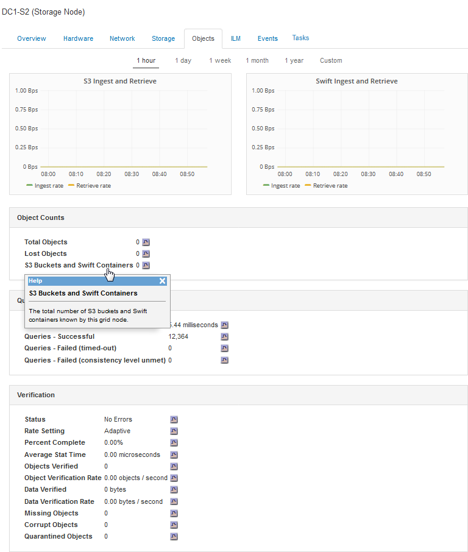

= Monitor object ingest and retrieval rates
:icons: font
:imagesdir: ../media/

[.lead]
You can monitor object ingest and retrieval rates as well as metrics for object counts, queries, and verification. You can view the number of successful and failed attempts by client applications to read, write, and modify objects in the StorageGRID system.

.Steps
. Sign in to the Grid Manager using a xref:../admin/web-browser-requirements.adoc[supported web browser].
. On the Dashboard, locate the Protocol Operations section.
+
This section summarizes the number of client operations performed by your StorageGRID system. Protocol rates are averaged over the last two minutes.

. Select *NODES*.
. From the Nodes home page (deployment level), click the *Load Balancer* tab.
+
The charts show trends for all client traffic directed to load balancer endpoints within the grid. You can select a time interval in hours, days, weeks, months, or years, or you can apply a custom interval.

. From the Nodes home page (deployment level), click the *Objects* tab.
+
The chart shows ingest and retrieve rates for your entire StorageGRID system in bytes per second and total bytes. You can select a time interval in hours, days, weeks, months, or years, or you can apply a custom interval.

. To see information for a particular Storage Node, select the node from the list on the left, and click the *Objects* tab.
+
The chart shows the object ingest and retrieval rates for this Storage Node. The tab also includes metrics for object counts, queries, and verification. You can click the labels to see the definitions of these metrics.
+

. If you want even more detail:
 .. Select *SUPPORT* > *Tools* > *Grid topology*.
 .. Select *_site_* > *Overview* > *Main*.
+
The API Operations section displays summary information for the entire grid.

 .. Select *_Storage Node_* > *LDR* > *_client application_* > *Overview* > *Main*
+
The Operations section displays summary information for the selected Storage Node.
