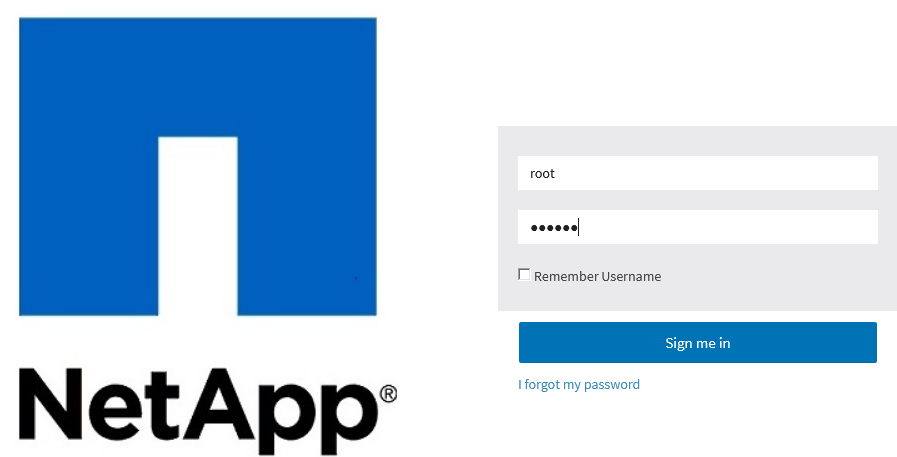
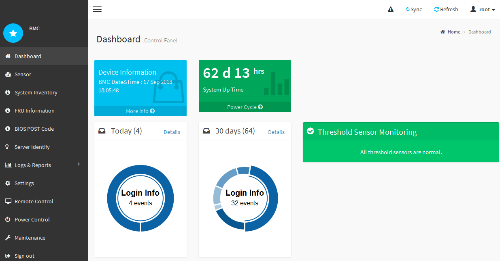

= Accessing the BMC interface
:icons: font
:imagesdir: ../media/

[.lead]
You can access the BMC interface on the services appliance using the DHCP or static IP address for the BMC management port.

.What you'll need

* The management client is using a xref:../admin/web-browser-requirements.adoc[supported web browser].
* The BMC management port on the services appliance is connected to the management network you plan to use.
+
*SG100 BMC management port*
+
image::../media/sg100_bmc_management_port.png[]
+
*SG1000 BMC management port*
+
image::../media/sg1000_bmc_management_port.png[SG1000 BMC Management Port]

.Steps

. Enter the URL for the BMC interface: +
`*https://_BMC_Port_IP_*`
+
For `_BMC_Port_IP_`, use the DHCP or static IP address for the BMC management port.
+
The BMC sign-in page appears.

. Enter the root username and password, using the password you set when you changed the default root password: +
`*root*`
+
`*_password_*`
+

. Click *Sign me in*
+
The BMC dashboard appears.
+

. Optionally, create additional users by selecting *Settings* > *User Management* and clicking on any "`disabled`" user.
+
NOTE: When users sign in for the first time, they might be prompted to change their password for increased security.

.Related information

xref:changing-root-password-for-bmc-interface-sg1000.adoc[Changing the root password for the BMC interface]
