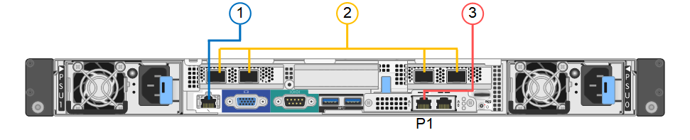
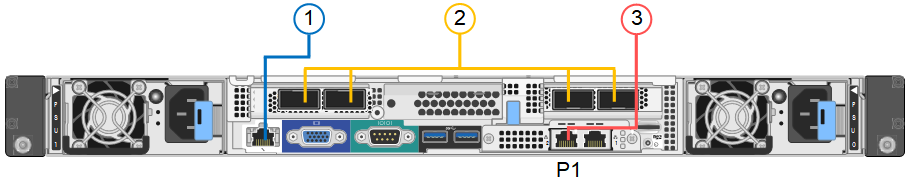

= Cabling the appliance SG100 and SG1000
:icons: font
:imagesdir: ../media/

[.lead]
You must connect the management port on the appliance to the service laptop and connect the network ports on the appliance to the Grid Network and optional Client Network for StorageGRID.

.What you'll need

* You have an RJ-45 Ethernet cable for connecting the management port.
* You have one of the following options for the network ports. These items are not provided with the appliance.
 ** One to four TwinAx cables for connecting the four network ports.
 ** For the SG100, one to four SFP+ or SFP28 transceivers if you plan to use optical cables for the ports.
 ** For the SG1000, one to four QSFP+ or QSFP28 transceivers if you plan to use optical cables for the ports.

CAUTION: *Risk of exposure to laser radiation* -- Do not disassemble or remove any part of a SFP or QSFP transceiver. You might be exposed to laser radiation.

.About this task

The following figures show the ports on the back of the appliance.

*SG100 port connections* 

*SG1000 port connections*

[options="header"]
|===
|  | Port| Type of port| Function
a|
1
a|
BMC management port on the appliance

a|
1-GbE (RJ-45)

a|
Connects to the network where you access the BMC interface.

a|
2
a|
Four network ports on the appliance
a|

* For the SG100: 10/25-GbE
* For the SG1000: 10/25/40/100-GbE

a|
Connect to the Grid Network and the Client Network for StorageGRID.

a|
3
a|
Admin Network port on the appliance (labelled P1 in the figures)
a|
1-GbE (RJ-45)

*Important:* This port operates only at 1000 baseT/full and does not support 10- or 100-megabit speeds.

a|
Connects the appliance to the Admin Network for StorageGRID.

a|
3
a|
Rightmost RJ-45 port on the appliance
a|
1-GbE (RJ-45)

*Important:* This port operates only at 1000 baseT/full and does not support 10- or 100-megabit speeds.

a|

* Can be bonded with management port 1 if you want a redundant connection to the Admin Network.
* Can be left disconnected and available for temporary local access (IP 169.254.0.1).
* During installation, can be used to connect the appliance to a service laptop if DHCP-assigned IP addresses are not available.

|===

.Steps

. Connect the BMC management port on the appliance to the management network, using an Ethernet cable.
+
Although this connection is optional, it is recommended to facilitate support.

. Connect the network ports on the appliance to the appropriate network switches, using TwinAx cables or optical cables and transceivers.
+
NOTE: The four network ports must use the same link speed. See the following tables for the equipment required based on your hardware and link speed.
+
[options="header"]
|===
| SG100 link speed (GbE)| Required equipment
a|
10
a|
SFP+ transceiver
a|
25
a|
SFP28 transceiver
|===
+
[options="header"]
|===
| SG1000 link speed (GbE)| Required equipment
a|
10
a|
QSA and SFP+ transceiver
a|
25
a|
QSA and SFP28 transceiver
a|
40
a|
QSFP+ transceiver
a|
100
a|
QFSP28 transceiver
|===

 ** If you plan to use Fixed port bond mode (default), connect the ports to the StorageGRID Grid and Client Networks, as shown in the table.
+
[options="header"]
|===
| Port| Connects to...
a|
Port 1
a|
Client Network (optional)
a|
Port 2
a|
Grid Network
a|
Port 3
a|
Client Network (optional)
a|
Port 4
a|
Grid Network
|===

 ** If you plan to use the Aggregate port bond mode, connect one or more of the network ports to one or more switches. You should connect at least two of the four ports to avoid having a single point of failure. If you use more than one switch for a single LACP bond, the switches must support MLAG or equivalent.

. If you plan to use the Admin Network for StorageGRID, connect the Admin Network port on the appliance to the Admin Network, using an Ethernet cable.
