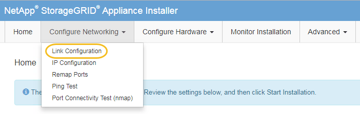

= Changing the link configuration of the services appliance
:icons: font
:imagesdir: ../media/

[.lead]
You can change the Ethernet link configuration of the services appliance. You can change the port bond mode, the network bond mode, and the link speed.

.What you'll need

* You must place the appliance in maintenance mode. Putting a StorageGRID appliance into maintenance mode might make the appliance unavailable for remote access.
+
xref:placing-appliance-into-maintenance-mode.adoc[Placing an appliance into maintenance mode]

.About this task

Options for changing the Ethernet link configuration of the services appliance include:

* Changing *Port bond mode* from Fixed to Aggregate, or from Aggregate to Fixed
* Changing *Network bond mode* from Active-Backup to LACP, or from LACP to Active-Backup
* Enabling or disabling VLAN tagging, or changing the value of a VLAN tag
* Changing the link speed

.Steps

. From the StorageGRID Appliance Installer, select *Configure Networking* > *Link Configuration*.
+

. Make the desired changes to the link configuration.
+
For more information on the options, see "`Configuring network links.`"

. When you are satisfied with your selections, click *Save*.
+
NOTE: You might lose your connection if you made changes to the network or link you are connected through. If you are not reconnected within 1 minute, re-enter the URL for the StorageGRID Appliance Installer using one of the other IP addresses assigned to the appliance: +
`*https://_services_appliance_IP_:8443*`

. Make any necessary changes to the IP addresses for the appliance.
+
If you made changes to the VLAN settings, the subnet for the appliance might have changed. If you need to change the IP addresses for the appliance, follow the instructions for configuring IP addresses.
+
xref:configuring-storagegrid-ip-addresses-sg100-and-sg1000.adoc[Configuring StorageGRID IP addresses]

. Select *Configure Networking* > *Ping Test* from the menu.
. Use the Ping Test tool to check connectivity to IP addresses on any networks that might have been affected by the link configuration changes you made when configuring the appliance.
+
In addition to any other tests you choose to perform, confirm that you can ping the Grid Network IP address of the primary Admin Node, and the Grid Network IP address of at least one other node. If necessary, return to the instructions for configuring network links, and correct any issues.

. Once you are satisfied that your link configuration changes are working, reboot the node. From the StorageGRID Appliance Installer, select *Advanced* > *Reboot Controller*, and then select one of these options:
 ** Select *Reboot into StorageGRID* to reboot the controller with the node rejoining the grid. Select this option if you are done working in maintenance mode and are ready to return the node to normal operation.
 ** Select *Reboot into Maintenance Mode* to reboot the controller with the node remaining in maintenance mode. Select this option if there are additional maintenance operations you need to perform on the node before rejoining the grid.
image:../media/reboot_controller_from_maintenance_mode.png[Reboot controller in maintenance mode]
+
It can take up to 20 minutes for the appliance to reboot and rejoin the grid. To confirm that the reboot is complete and that the node has rejoined the grid, go back to the Grid Manager. The *Nodes* tab should display a normal status image:../media/icon_alert_green_checkmark.png[icon alert green checkmark] for the appliance node, indicating that no alerts are active and the node is connected to the grid.
+
image::../media/node_rejoin_grid_confirmation.png[Appliance node rejoined grid]
