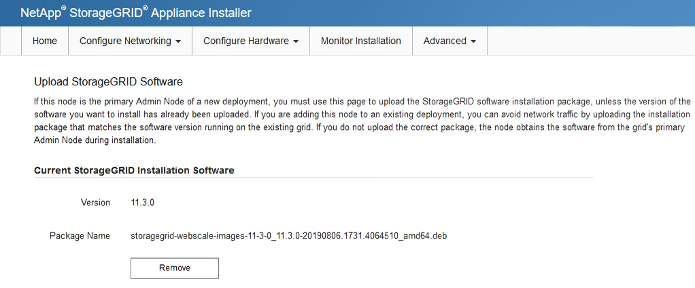
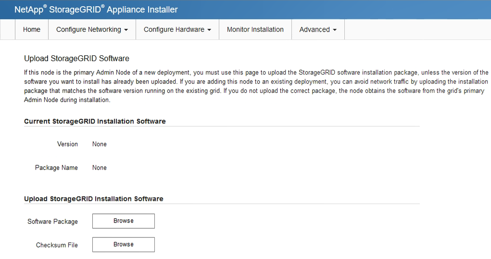
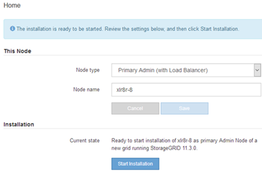

= Deploy services appliance as primary Admin Node
:icons: font
:imagesdir: ../media/

[.lead]
When you deploy a services appliance as a primary Admin Node, you use the StorageGRID Appliance Installer included on the appliance to install the StorageGRID software, or you upload the software version you want to install. You must install and configure the primary Admin Node before you install any other appliance node types. A primary Admin Node can connect to the Grid Network, and to the optional Admin Network and Client Network, if one or both are configured.

.What you'll need

* The appliance has been installed in a rack or cabinet, connected to your networks, and powered on.
* Network links, IP addresses, and port remapping (if necessary) have been configured for the appliance using the StorageGRID Appliance Installer.
+
IMPORTANT: If you have remapped any ports, you cannot use the same ports to configure load balancer endpoints. You can create endpoints using remapped ports, but those endpoints will be remapped to the original CLB ports and service, not the Load Balancer service. Follow the steps in xref:../maintain/removing-port-remaps.adoc[Remove port remaps].
+
See xref:../admin/how-load-balancing-works-clb-service.adoc[How load balancing works - CLB service (deprecated)] for more information on the CLB service.
+
NOTE: The CLB service is deprecated.

* You have a service laptop with a xref:../admin/web-browser-requirements.adoc[supported web browser].
* You know one of the IP addresses assigned to the appliance. You can use the IP address for any attached StorageGRID network.

.About this task

To install StorageGRID on an appliance primary Admin Node:

* You use the StorageGRID Appliance Installer to install the StorageGRID software. If you want to install a different version of the software, you first upload it using the StorageGRID Appliance Installer.
* You wait as the software is installed.
* When the software has been installed, the appliance is rebooted automatically.

.Steps

. Open a browser, and enter the IP address for the appliance. +
`*https://_services_appliance_IP_:8443*`
+
The StorageGRID Appliance Installer Home page appears.

. In the *This Node* section, select *Primary Admin*.
. In the *Node name* field, enter the name you want to use for this appliance node, and click *Save*.
+
The node name is assigned to this appliance node in the StorageGRID system. It is shown on the Grid Nodes page in the Grid Manager.

. Optionally, to install a different version of the StorageGRID software, follow these steps:
 .. Download the installation archive from the NetApp Downloads page for StorageGRID.
+
https://mysupport.netapp.com/site/products/all/details/storagegrid/downloads-tab[NetApp Downloads: StorageGRID^]

 .. Extract the archive.
 .. From the StorageGRID Appliance Installer, select *Advanced* > *Upload StorageGRID Software*.
 .. Click *Remove* to remove the current software package.
+

 .. Click *Browse* for the software package you downloaded and extracted, and then click *Browse* for the checksum file.
+

 .. Select *Home* to return to the Home page.
. Confirm that the current state is "`Ready to start installation of primary Admin Node name with software version x.y`" and that the *Start Installation* button is enabled.
+
NOTE: If you are deploying the Admin Node appliance as a node cloning target, stop the deployment process here and continue the node cloning procedure by following the xref:../maintain/index.adoc[Recover and maintain] instructions.

. From the StorageGRID Appliance Installer home page, click *Start Installation*.
+

+
The Current state changes to "`Installation is in progress,`" and the Monitor Installation page is displayed.
+
NOTE: If you need to access the Monitor Installation page manually, click *Monitor Installation* from the menu bar.