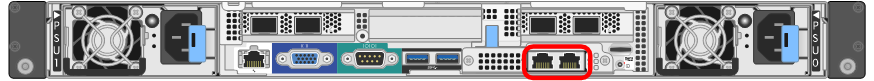
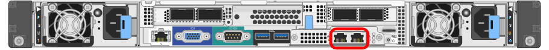
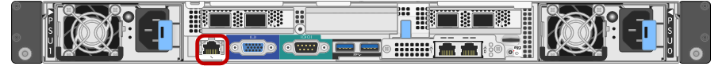
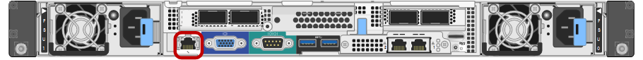

= Gathering installation information (SG100 and SG1000)
:icons: font
:imagesdir: ../media/

[.lead]
As you install and configure the StorageGRID appliance, you must make decisions and gather information about Ethernet switch ports, IP addresses, and port and network bond modes. Record the required information for each network you connect to the appliance. These values are required to install and configure the hardware.

== Administration and maintenance ports

The Admin Network for StorageGRID is an optional network, used for system administration and maintenance. The appliance connects to the Admin Network using the following 1-GbE management ports on the appliance.

*SG100 RJ-45 ports*

*SG1000 RJ-45 ports*

*Administration and maintenance connections*

[options="header"]
|===
| Information needed| Your value
a|
Admin Network enabled
a|
Choose one:

* No
* Yes (default)

a|
Network bond mode
a|
Choose one:

* Independent (default)
* Active-Backup

a|
Switch port for the left port circled in the diagram (default active port for Independent network bond mode)
a|

a|
Switch port for the right port circled in the diagram (Active-Backup network bond mode only)
a|

a|
MAC address for the Admin Network port

*Note:* The MAC address label on the front of the appliance lists the MAC address for the BMC management port. To determine the MAC address for the Admin Network port, you must add *2* to the hexadecimal number on the label. For example, if the MAC address on the label ends in *09*, the MAC address for the Admin Port would end in *0B*. If the MAC address on the label ends in *(_y_)FF*, the MAC address for the Admin Port would end in *(_y_+1)01*. You can easily make this calculation by opening Calculator in Windows, setting it to Programmer mode, selecting Hex, typing the MAC address, then typing *+ 2 =*.

a|

a|
DHCP-assigned IP address for the Admin Network port, if available after power on

*Note:* You can determine the DHCP-assigned IP address by using the MAC address to look up the assigned IP.

a|

* IPv4 address (CIDR):
* Gateway:

a|
Static IP address you plan to use for the appliance node on the Admin Network

*Note:* If your network does not have a gateway, specify the same static IPv4 address for the gateway.

a|

* IPv4 address (CIDR):
* Gateway:

a|
Admin Network subnets (CIDR)
a|

|===

== Networking ports

The four networking ports on the appliance connect to the StorageGRID Grid Network and the optional Client Network.

*Networking connections*

[options="header"]
|===
| Information needed| Your value
a|
Link speed

a|
For the SG100, choose one of the following:

* Auto (default)
* 10 GbE
* 25 GbE

For the SG1000, choose one of the following:

* Auto (default)
* 10 GbE
* 25 GbE
* 40 GbE
* 100 GbE

*Note:* For the SG1000, 10- and 25-GbE speeds require the use of QSA adapters.

a|
Port bond mode

a|
Choose one:

* Fixed (default)
* Aggregate

a|
Switch port for port 1 (Client Network for Fixed mode)

a|

a|
Switch port for port 2 (Grid Network for Fixed mode)

a|

a|
Switch port for port 3 (Client Network for Fixed mode)

a|

a|
Switch port for port 4 (Grid Network for Fixed mode)

a|

|===

== Grid Network ports

The Grid Network for StorageGRID is a required network, used for all internal StorageGRID traffic. The appliance connects to the Grid Network using the four network ports.

*Grid Network connections*

[options="header"]
|===
| Information needed| Your value
a|
Network bond mode
a|
Choose one:

* Active-Backup (default)
* LACP (802.3ad)

a|
VLAN tagging enabled
a|
Choose one:

* No (default)
* Yes

a|
VLAN tag(if VLAN tagging is enabled)

a|
Enter a value between 0 and 4095:
a|
DHCP-assigned IP address for the Grid Network, if available after power on
a|

* IPv4 address (CIDR):
* Gateway:

a|
Static IP address you plan to use for the appliance node on the Grid Network

*Note:* If your network does not have a gateway, specify the same static IPv4 address for the gateway.

a|

* IPv4 address (CIDR):
* Gateway:

a|
Grid Network subnets (CIDRs)
a|

a|
Maximum transmission unit (MTU) setting (optional)You can use the default value of 1500, or set the MTU to a value suitable for jumbo frames, such as 9000.

a|

|===

== Client Network ports

The Client Network for StorageGRID is an optional network, typically used to provide client protocol access to the grid. The appliance connects to the Client Network using the four network ports.

*Client Network connections*

[options="header"]
|===
| Information needed| Your value
a|
Client Network enabled
a|
Choose one:

* No (default)
* Yes

a|
Network bond mode
a|
Choose one:

* Active-Backup (default)
* LACP (802.3ad)

a|
VLAN tagging enabled
a|
Choose one:

* No (default)
* Yes

a|
VLAN tag(If VLAN tagging is enabled)

a|
Enter a value between 0 and 4095:

a|
DHCP-assigned IP address for the Client Network, if available after power on
a|

* IPv4 address (CIDR):
* Gateway:

a|
Static IP address you plan to use for the appliance node on the Client Network

*Note:* If the Client Network is enabled, the default route on the appliance will use the gateway specified here.

a|

* IPv4 address (CIDR):
* Gateway:

|===

== BMC management network ports

You can access the BMC interface on the services appliance using the 1-GbE management port circled in the diagram. This port supports remote management of the controller hardware over Ethernet using the Intelligent Platform Management Interface (IPMI) standard.

*SG100 BMC management port*

*SG1000 BMC management port*

*BMC management network connections*

[options="header"]
|===
| Information needed| Your value
a|
Ethernet switch port you will connect to the BMC management port (circled in the diagram)
a|

a|
DHCP-assigned IP address for the BMC management network, if available after power on
a|

* IPv4 address (CIDR):
* Gateway:

a|
Static IP address you plan to use for the BMC management port
a|

* IPv4 address (CIDR):
* Gateway:

|===
.Related information

xref:sg100-and-sg1000-appliances-overview.adoc[SG100 and SG1000 appliances overview]

xref:cabling-appliance-sg100-and-sg1000.adoc[Cabling the appliance SG100 and SG1000)]

xref:configuring-storagegrid-ip-addresses-sg100-and-sg1000.adoc[Configuring StorageGRID IP addresses]
