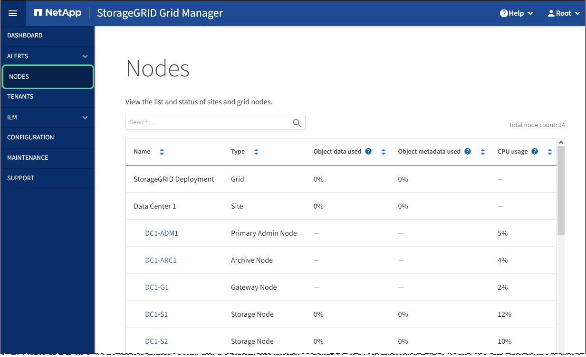

= Monitor node encryption in maintenance mode (SG100 and SG1000)
:icons: font
:imagesdir: ../media/

[.lead]
If you enabled node encryption for the appliance during installation, you can monitor the node-encryption status of each appliance node, including the node-encryption state and key management server (KMS) details.

.What you'll need

* You enabled node encryption for the appliance during installation. You cannot enable node encryption after the appliance is installed.
* You have xref:placing-appliance-into-maintenance-mode.adoc[placed the appliance into maintenance mode].

.Steps

. From the StorageGRID Appliance Installer, select *Configure Hardware* > *Node Encryption*.
+
image::../media/fde_monitor_in_maint_mode.png[KMS clear configuration]
+
The Node Encryption page includes three sections:

 ** Encryption Status shows whether node encryption is enabled or disabled for the appliance.
 ** Key Management Server Details shows information about the KMS being used to encrypt the appliance. You can expand the server and client certificate sections to view certificate details and status.
  *** To address issues with the certificates themselves, such as renewing expired certificates, see the xref:../admin/kms-configuring.adoc[instructions for configuring KMS].
  *** If there are unexpected problems connecting to KMS hosts, verify that the xref:checking-dns-server-configuration.adoc[domain name system (DNS) servers are correct] and that xref:configuring-network-links-sg100-and-sg1000.adoc[appliance networking is correctly configured].
  *** If you are unable to resolve your certificate issues, contact technical support.
 ** Clear KMS Key disables node encryption for the appliance, removes the association between the appliance and the key management server that was configured for the StorageGRID site, and deletes all data from the appliance. You must xref:clearing-key-management-server-configuration.adoc[clear the KMS key] before you can install the appliance into another StorageGRID system.
+
IMPORTANT: Clearing the KMS configuration deletes data from the appliance, rendering it permanently inaccessible. This data is not recoverable.

. When you are done checking node-encryption status, reboot the node. From the StorageGRID Appliance Installer, select *Advanced* > *Reboot Controller*, and then select one of these options:
 ** Select *Reboot into StorageGRID* to reboot the controller with the node rejoining the grid. Select this option if you are done working in maintenance mode and are ready to return the node to normal operation.
 ** Select *Reboot into Maintenance Mode* to reboot the controller with the node remaining in maintenance mode. (This option is available only when the controller is in maintenance mode.) Select this option if there are additional maintenance operations you need to perform on the node before it can rejoin the grid.
+
image::../media/reboot_controller_from_maintenance_mode.png[Reboot controller in maintenance mode]
+
It can take up to 20 minutes for the appliance to reboot and rejoin the grid. To confirm that the reboot is complete and that the node has rejoined the grid, go back to the Grid Manager. The *NODES* page should display a normal status (no icon) for the appliance node, indicating that no alerts are active and the node is connected to the grid.
+

.Related information

xref:../admin/index.adoc[Administer StorageGRID]
