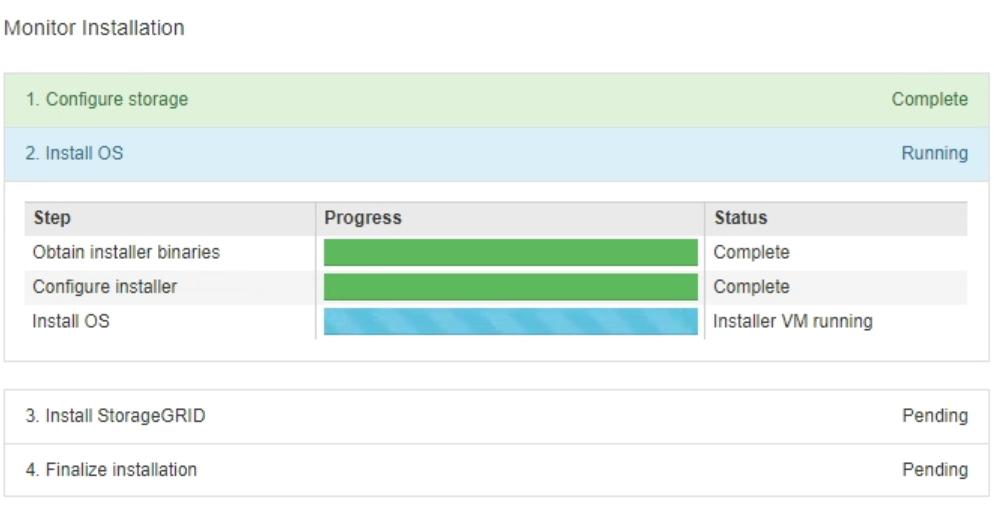
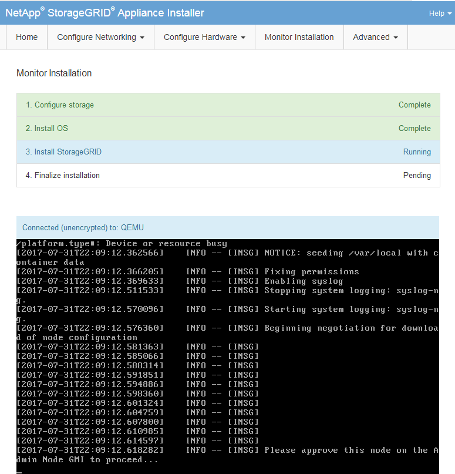

= Monitoring the services appliance installation
:icons: font
:imagesdir: ../media/

[.lead]
The StorageGRID Appliance Installer provides status until installation is complete. When the software installation is complete, the appliance is rebooted.

.Steps

. To monitor the installation progress, click *Monitor Installation* from the menu bar.
+
The Monitor Installation page shows the installation progress.
+

+
The blue status bar indicates which task is currently in progress. Green status bars indicate tasks that have completed successfully.
+
NOTE: The installer ensures that tasks completed in a previous install are not re-run. If you are re-running an installation, any tasks that do not need to be re-run are shown with a green status bar and a status of "`Skipped.`"

. Review the progress of first two installation stages.
 ** *1. Configure storage*
+
During this stage, the installer clears any existing configuration from the drives in the appliance, and configures host settings.

 ** *2. Install OS*
+
During this stage, the installer copies the base operating system image for StorageGRID to the appliance.
. Continue monitoring the installation progress until one of the following processes occurs:
 ** For all appliance nodes except the primary Admin Node, the Install StorageGRID stage pauses and a message appears on the embedded console, prompting you to approve this node on the Admin Node using the Grid Manager. Go to the next step.
 ** For appliance primary Admin Node installation, you do not need to approve the node. The appliance is rebooted. You can skip the next step.
+
NOTE: During installation of an appliance primary Admin Node, a fifth phase appears (see the example screen shot showing four phases). If the fifth phase is in progress for more than 10 minutes, refresh the web page manually.
+

. Go to the Grid Manager, approve the pending grid node, and complete the StorageGRID installation process.
+
When you click *Install* from the Grid Manager, Stage 3 completes and stage 4, *Finalize Installation*, begins. When stage 4 completes, the appliance is rebooted.
