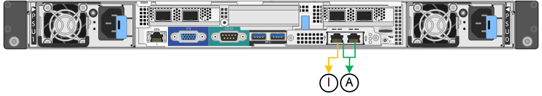
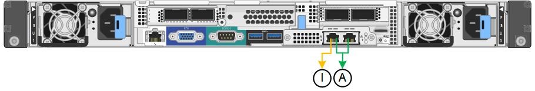

= Network bond modes for the management ports
:icons: font
:imagesdir: ../media/

[.lead]
For the two 1-GbE management ports on the services appliance, you can choose Independent network bond mode or Active-Backup network bond mode to connect to the optional Admin Network.

*SG100 network management ports*

*SG1000 network management ports*

In Independent mode, only the management port on the left is connected to the Admin Network. This mode does not provide a redundant path. The management port on the right is unconnected and available for temporary local connections (uses IP address 169.254.0.1)

In Active-Backup mode, both management ports are connected to the Admin Network. Only one port is active at a time. If the active port fails, its backup port automatically provides a failover connection. Bonding these two physical ports into one logical management port provides a redundant path to the Admin Network.

NOTE: If you need to make a temporary local connection to the services appliance when the 1-GbE management ports are configured for Active-Backup mode, remove the cables from both management ports, plug your temporary cable into the management port on the right, and access the appliance using IP address 169.254.0.1.

[options="header"]
|===
| Callout| Network bond mode
a|
A
a|
Active-Backup mode. Both management ports are bonded into one logical management port connected to the Admin Network.
a|
I
a|
Independent mode. The port on the left is connected to the Admin Network. The port on the right is available for temporary local connections (IP address 169.254.0.1).
|===
