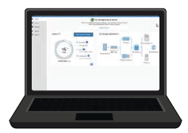
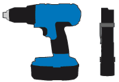

= Obtain additional equipment and tools (SG100 and SG1000)
:icons: font
:imagesdir: ../media/

[.lead]
Before installing the StorageGRID appliance, confirm you have all of the additional equipment and tools that you need.

You need the following additional equipment to install and configure the hardware:

* *Screwdrivers*
+
image::../media/screwdrivers.gif[Two screwdrivers]
+
Phillips No. 2 screwdriver
+
Medium flat-blade screwdriver

* *ESD wrist strap*
+
image::../media/appliance_wriststrap.gif[ESD wrist strap]

* *Optical cables and transceivers*
+
image::../media/fc_cable_and_sfp.gif[Optical cable and QSFP+ transceiver]

 ** Cable
  *** TwinAx/Copper (1 to 4)
+
or

  *** Fibre/Optical (1 to 4)
 ** 1 to 4 of each of these transceivers/adapters based on link speed (mixed speeds are not supported)
  *** SG100:
+
[options="header"]
|===
| Link speed (GbE)| Required equipment
a|
10
a|
SFP+ transceiver
a|
25
a|
SFP28 transceiver
|===

  *** SG1000:
+
[options="header"]
|===
| Link speed (GbE)| Required equipment
a|
10
a|
QSFP-to-SFP adapter (QSA) and SFP+ transceiver
a|
25
a|
QSFP-to-SFP adapter (QSA) and SFP28 transceiver
a|
40
a|
QSFP+ transceiver
a|
100
a|
QFSP28 transceiver
|===

* *RJ-45 (Cat5/Cat5e/Cat6/Cat6a) Ethernet cables*
+

* *Service laptop*
+

+
xref:../admin/web-browser-requirements.adoc[Supported web browser]
+
1-GbE (RJ-45) port
+
NOTE: Some ports might not support 10/100 Ethernet speeds.

* *Optional tools*
+

+
Power drill with Phillips head bit
+
Flashlight
