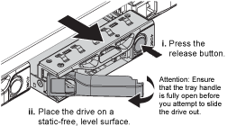
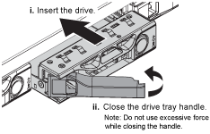

= Replacing a drive in the services appliance
:icons: font
:imagesdir: ../media/

[.lead]
The SSDs in the services appliance contain the StorageGRID operating system. Additionally, when the appliance is configured as an Admin Node, the SSDs also contain audit logs, metrics, and database tables. The drives are mirrored using RAID1 for redundancy. If one of the drives fails, you must replace it as soon as possible to ensure redundancy.

.What you'll need

* You have physically located the appliance where you are replacing the drive in the data center.
+
xref:locating-controller-in-data-center.adoc[Locating the controller in a data center]

* You have verified which drive has failed by noting that its left LED is blinking amber.
+
IMPORTANT: If you remove the working drive, you will bring down the appliance node. See the information about viewing status indicators to verify the failure.

* You have obtained the replacement drive.
* You have obtained proper ESD protection.

.Steps

. Verify that the drive's left LED is blinking amber.
+
You can also use the Grid Manager to monitor the status of the SSDs. Select *Nodes*. Then select `*Appliance Node*` > *Hardware*. If a drive has failed, the Storage RAID Mode field contains a message about which drive has failed.

. Wrap the strap end of the ESD wristband around your wrist, and secure the clip end to a metal ground to prevent static discharge.
. Unpack the replacement drive, and set it on a static-free, level surface near the appliance.
+
Save all packing materials.

. Press the release button on the failed drive.
+

+
The handle on the drive springs open partially, and the drive releases from the slot.

. Open the handle, slide the drive out, and place it on a static-free, level surface.
. Press the release button on the replacement drive before you insert it into the drive slot.
+
The latch springs open.
+

. Insert the replacement drive in the slot, and then close the drive handle.
+
IMPORTANT: Do not use excessive force while closing the handle.
+
When the drive is fully inserted, you hear a click.
+
The drive is automatically rebuilt with mirrored data from the working drive. You can check the status of the rebuild by using the Grid Manager. Select *Nodes*. Then select `*Appliance Node*` > *Hardware*. The Storage RAID Mode field contains a "`rebuilding`" message until the drive is completely rebuilt.

. Contact technical support about the drive replacement.
+
Technical support will provide instructions for returning the failed drive.
