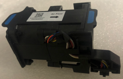
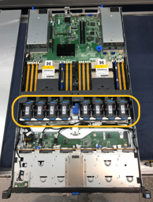
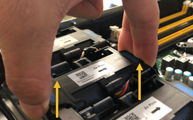
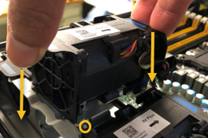
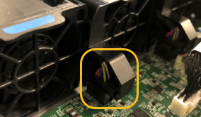

= Replacing a fan in the services appliance
:icons: font
:imagesdir: ../media/

[.lead]
The services appliance has eight cooling fans. If one of the fans fails, you must replace it as soon as possible to ensure that the appliance has proper cooling.

.What you'll need

* You have unpacked the replacement fan.
* You have physically located the appliance where you are replacing the fan in the data center.
+
xref:locating-controller-in-data-center.adoc[Locating the controller in a data center]

* You have confirmed that the other fans are installed and running.
* The appliance has been placed maintenance mode.
+
xref:placing-appliance-into-maintenance-mode.adoc[Placing an appliance into maintenance mode]

.About this task

The appliance node will not be accessible while you replace the fan.

The photograph shows a fan for the services appliance. The cooling fans are accessible after you take the top cover off of the appliance.

NOTE: Each of the two power supply units also contain a fan. Those fans are not included in this procedure.

.Steps

. When the appliance has been placed maintenance mode, shut down the appliance.
 .. Log in to the grid node:
  ... Enter the following command: `ssh admin@_grid_node_IP_`
  ... Enter the password listed in the `Passwords.txt` file.
  ... Enter the following command to switch to root: `su -`
  ... Enter the password listed in the `Passwords.txt` file.
+
When you are logged in as root, the prompt changes from `$` to `#`.
 .. Shut down the services appliance: +
`*shutdown -h now*`
. Use one of two methods to verify that the power for the services appliance is off:
 ** The power indicator LED on the front of the appliance is off.
 ** The Power Control page of the BMC interface indicates that the appliance is off.
. Lift the latch on the top cover and remove the cover from the appliance.
. Locate the fan that failed.
+

. Lift the failed fan out of the chassis.
+

. Slide the replacement fan into the open slot in the chassis.
+
Line up the edge of the fan with the guide pin. The pin is circled in the photograph.
+

. Press the fan's connector firmly into the circuit board.
+

. Put the top cover back on the appliance, and press the latch down to secure the cover in place.
. Power on the appliance and monitor the controller LEDs and boot-up codes.
+
Use the BMC interface to monitor boot-up status.

. Confirm that the appliance node appears in the Grid Manager and that no alerts appear.
